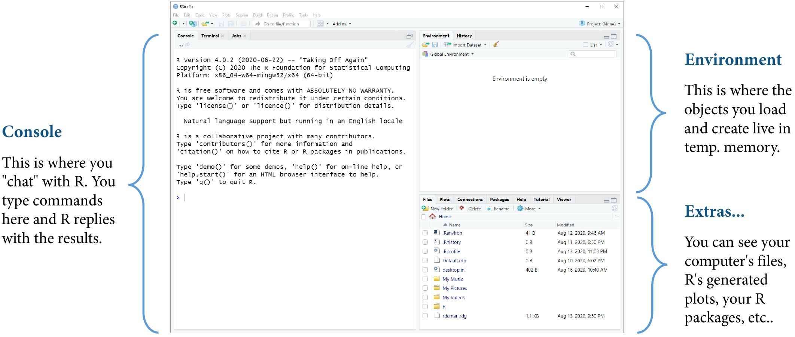

::: {.my-title}
# [Foundations of]{.my-subtitle}<br />[Data Science]{.blue}

::: {.my-grey}
[ | ]{}<br />
[Jeffrey M. Girard | Lecture ]{}
:::

{.absolute bottom=30 right=0 width="400"}
:::

## Roadmap

::: {.columns .pv4}

::: {.column width="60%"}
1. Install R and RStudio on your laptop computer

2. Learn to use the R Console as a scientific calculator
:::

::: {.column .tc .pv4 width="40%"}

:::

:::


# R and RStudio

## Programming is a Superpower

::: {.columns .pv4}

::: {.column width="60%"}
- Programming is how we talk to and control our amazing computers

- It gives us power and flexibility

- Everything we do in this course will be accomplished via programming

- Programming will leave a record of what we did (i.e., code), so we can later reuse, adapt, and share it
:::

::: {.column .tc .pv4 width="40%"}

:::

:::


## Common Data Science Languages {.smaller}

#### General Purpose

- [R]{.b .blue} (interactive, welcoming)
    - *Strengths:* statistics, data wrangling, data visualization
    - *Weaknesses:* relatively slow, not security-focused

::: {.fragment}
- [Python]{.b .blue} (popular, versatile)
    - *Strengths:* automation, machine learning, data wrangling
    - *Weaknesses:* relatively slow
:::  
  
::: {.fragment}
- [Java]{.b .green} / [C++]{.b .green} / [Scala]{.b .green} / [Julia]{.b .green} (faster but older and harder or newer and smaller)
:::

::: {.fragment}
#### Special Purpose

- JavaScript (web), SQL (databases), Swift (mobile), MATLAB (neuroscience), etc.
:::


## The R Ecosystem {.smaller}

::: {.columns .pv4}
::: {.column width="60%"}
1.  Think of your [computer]{.b .blue} as the [engine]{.b .green} of a car
    -   It provides raw power for computation

::: {.fragment .mt1}
2.  The [R language]{.b .blue} is like the [controls]{.b .green} for the car
    -   It lets you apply and direct that power
:::

::: {.fragment .mt1}
3.  [RStudio]{.b .blue} is like a fancy [dashboard]{.b .green} for the car
    -   It adds extra information and convenience
:::

::: {.fragment .mt1}
4.  An [R package]{.b .blue} is like an [add-on]{.b .green} for the car
    -   It adds new features and capabilities
:::
:::

::: {.column .tc .pv5 .relative width="40%"}

:::
:::


## Installing R {.smaller}

::: {.columns .pv4}
::: {.column .pr4 width="50%"}
#### Windows

1.  Open a web browser
2.  Visit [cloud.r-project.org](https://cloud.r-project.org)
3.  Click "Download R for Windows"
4.  Click the "base" subdirectory link
5.  Click "Download R-4.X.X" (e.g., 4.5.2)
6.  Run the downloaded .exe file
7.  Select all the default options
8.  Complete the installation wizard
:::

::: {.column width="50%"}
#### Mac OS

1.  Open a web browser
2.  Visit [cloud.r-project.org](https://cloud.r-project.org)
3.  Click "Download R for macOS"
4.  Click "R-4.X.X.pkg" (e.g., 4.5.2)
5.  Run the downloaded .pkg file
6.  Select all the default options
7.  Complete the installation wizard
:::
:::

::: aside
*Note.* You will need to repeat this process every time a new version of R is released (every 4–5 months).
:::


## Installing RStudio {.smaller}

::: {.columns .pv4}
::: {.column .pr4 width="50%"}
#### Windows

1.  Open a web browser
2.  Visit [posit.co/download/rstudio-desktop](https://posit.co/download/rstudio-desktop/){preview-link="false"}
3.  Scroll down until you find "2: Install RStudio"
4.  Click "Download RStudio Desktop for Windows"
5.  Run the downloaded .exe file
6.  Select all the default options
7.  Complete the installation wizard
:::

::: {.column width="50%"}
#### Mac OS

1.  Open a web browser
2.  Visit [posit.co/download/rstudio-desktop](https://posit.co/download/rstudio-desktop/){preview-link="false"}
3.  Scroll down until you find "2: Install RStudio"
4.  Click "Download RStudio Desktop for macOS 14/15/26"
5.  Run the downloaded .dmg file
6.  Select all the default options
7.  Drag the RStudio icon to your Applications folder (if you want)
:::
:::

::: aside
*Note.* You will need to repeat this process every time a new version of RStudio is released (every 2–4 months).
:::


## RStudio Window {.smaller}




::: aside
*Note.* You can customize RStudio (e.g., the fonts, color themes, and pane layout) under "Tools \> Global Options".
:::


# Console

## R will Grant your Wishes {.smaller}

::: {.columns .pv4}
::: {.column width="60%"}
-   R is like a [well-meaning]{.b .green} but [overly literal]{.b .green} genie

    -   It has the power to grant almost any wish
    -   But we must phrase our wishes carefully!
    -   *We will always get what we ask for...*
    -   *...but not always what we wanted.*

::: {.fragment .mt1}
-   Mastering the [R language]{.b .blue} means learning...

    -   How to properly phrase commands
    -   How to decipher error messages
    -   How to view code from R's perspective
    -   How to detect and correct small mistakes
:::
:::

::: {.column .tc .pv5 width="40%"}

:::
:::


## Communicating with R {.smaller}

::: {.columns .pv4}
::: {.column width="60%"}
-   The [Console]{.b .blue} is like a [chat window]{.b .green} with R
    -   You send a command to R and get a response
    -   Neither side of the conversation is saved

::: {.fragment .mt1}
-   An [R Script]{.b .blue} is like an [email thread]{.b .green} with R
    -   You send many commands to R all at once
    -   Only your side of the conversation is saved
:::

::: {.fragment .mt1}
-   A [Quarto Document]{.b .blue} is like a [scrapbook]{.b .green} with R
    -   You can combine code and formatted text
    -   Both sides of the conversation are saved
:::
:::

::: {.column .tc .pv5 width="40%"}

:::
:::


## Simple Operations

```{r}
# Addition
10 + 3

# Subtraction
10 - 3

# Multiplication
10 * 3

# Division
10 / 3
```

## Errors to Avoid

```{r}
#| error: true

# Only use * for multiplication
10 x 3
```

```{r}
#| error: true

# Only use / for division
10 \ 3
```

## Advanced Operations

```{r}
# Exponentiation
10 ^ 2

# Default Order of Operations
10 + 3 * 2

# Override Order of Operations
(10 + 3) * 2

# Negative Numbers
10 + -30
```

## Advanced Numbers

```{r}
# Decimals
1.234

# Fractions
(1 / 3)

# Leading and Trailing Zeros
09.870

# Large Numbers
9876543
```

## Errors to Avoid

```{r}
#| error: true

# Don't include commas inside numbers
9,876,543
```

```{r}
#| error: true

# Don't include spaces inside numbers
9 876 543
```
