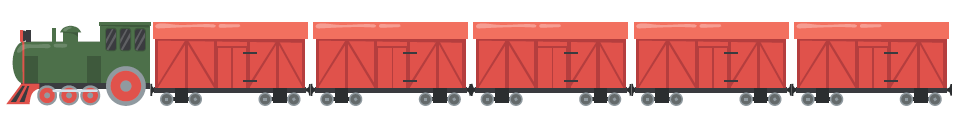

::: {.my-title}
# [Foundations of]{.my-subtitle}<br />[Data Science]{.blue}

::: {.my-grey}
[ | ]{}<br />
[Jeffrey M. Girard | Lecture ]{}
:::

{.absolute bottom=30 right=0 width="400"}
:::

## Roadmap

::: {.columns .pv4}

::: {.column width="60%"}
1. Customize the behavior of functions by modifying their arguments

2. Collect multiple objects into vectors using the `c()` function
:::

::: {.column .tc .pv4 width="40%"}

:::

:::

# Arguments

## Arguments {.smaller}

::: {.columns .pv4}
::: {.column width="60%"}
-   [Recipes]{.b .green} allow chefs to cook up tasty treats
    -   Recipes call for ingredients
    -   Recipes involve one or more steps
    -   Steps transform ingredients into treats

::: {.fragment .mt1}
-   [Functions]{.b .blue} are like *customizable* recipes
    -   Functions call for inputs ("arguments")
    -   Functions involve one or more lines of code
    -   Code transforms inputs into outputs
    -   Put all arguments in the parentheses
    -   Separate the arguments using commas
:::
:::

::: {.column .tc .pv5 width="40%"}


::: {.fragment}
`out <- f(in1, in2, in3)`
:::
:::
:::

## Customized Rounding

```{r}
# Default rounds to nearest even integer
round(2 / 3)

# But we can customize to round to 2 digits
round(2 / 3, digits = 2)

# Or to 3 digits
round(2 / 3, digits = 3)

# The "default" value is digits = 0
round(2 / 3, digits = 0)
```

## Customized Logarithms

```{r}
# Default is the natural logarithm (base = e)
log(10)

# Verifying this using exp(1), which is e
log(10, base = exp(1))

# Changing to base 2
log(10, base = 2)

# Changing to base 10
log(10, base = 10)
```

## Multiple Arguments

Randomly sample from the uniform distribution

```{r}
# Generate n numbers between min and max, all equally likely
runif(n = 1, min = 10, max = 20)
```

Randomly sample from the normal distribution

```{r}
# Generate n numbers from a population with mean and sd
rnorm(n = 1, mean = 100, sd = 15)
```

# Vectors

## Vectors {.smaller}

::: {.columns .pv4}
::: {.column width="60%"}
-   [Vectors]{.b .blue} combine similar objects into a collection
    -   *I like to imagine a train pulling multiple cars*<br />
    
    -   A vector is one object with many sub-objects
    -   We refer to each sub-object as an [element]{.b .green}

::: {.fragment .mt1}
-   Some functions [transform each element]{.b .green} in turn
    -   *Double the amount of cargo in every train car*
:::

::: {.fragment .mt1}
-   Some functions [summarize across elements]{.b .green}
    -   *Calculate the total cargo across all train cars*
:::
:::

::: {.column .tc .pv5 width="40%"}


::: {.fragment}
`v <- c(1, 2, 3)`
:::

:::
:::

## Creating Simple Vectors

```{r}
#| error: true

# We can't just type the elements out in a row
x <- 4 9 16 25 36
```

```{r}
# Instead, we need to collect them using c()
x <- c(4, 9, 16, 25, 36)
x
```

```{r}
# We can also append to a vector using c()
y <- c(x, 49, 64)
y
```

## Generating Sequences

```{r}
# You can use seq() to generate sequence vectors
x <- seq(from = 10, to = 20)
x

# You can use by the control the spacing
y <- seq(from = 10, to = 20, by = 2)
y

# Sometimes length.out is more useful than by
z <- seq(from = 10, to = 20, length.out = 5)
z
```

## Elementwise Operations

```{r}
x <- c(10, 20, 30)
```

```{r}
# Multiply every element in x by 3
y <- x * 3
y

# Subtract each element of y from the corresponding element in x
z <- x - y
z
```

:::{.fsmaller}
Note that, for this to work, both vectors need the same number of elements
:::

## Elementwise Functions

```{r}
x <- c(4, 9, 16, 25)
```

```{r}
# Some functions also transform each element
sqrt(x)

# You can also combine operations and functions
log(x * 10)

# This can even apply with nested functions
round(log(x * 10))
```

## Summary Functions

```{r}
x <- c(10, 11, 12, 13, 14)
```

```{r}
# The length of a vector is its number of elements
length(x)

# The sum of a vector adds all its elements together
sum(x)

# The mean of a vector divides the sum by the length
mean(x)
```

:::{.fsmaller}
Others include: `prod()`, `min()`, `max()`, `sd()`, `median()`, and `mad()`
:::
