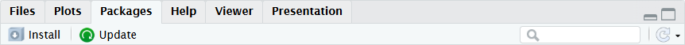

::: {.my-title}
# [Foundations of]{.my-subtitle} <br />[Data Science]{.blue}

::: {.my-grey}
[ | ]{}<br />
[Jeffrey M. Girard | Lecture ]{}
:::

{.absolute bottom=30 right=0 width="400"}
:::

## Roadmap

::: {.columns .pv4}

::: {.column width="60%"}
1. Store text/character data in strings and character vectors

2. Install, load, and use data and functions from R packages
:::

::: {.column .tc .pv4 width="40%"}

:::

:::

# Strings

## Strings {.smaller}

::: {.columns .pv4}
::: {.column width="60%"}
-   When talking to R, we need a way to distinguish
    -   Object/function names (e.g., the *mean* function)
    -   Text/character data (e.g., the letters *mean*)
    
::: {.fragment .mt1}
-   [Strings]{.b .blue} are R's way of storing text data
    -   Strings can store any characters (no rules!)
    -   Strings are created and displayed with [quotes]{.b .green}
:::
::: {.fragment .mt1}
-   R has great tools for working with strings
    -   Strings can be collected into vectors
    -   Special functions can transform strings
:::
:::

::: {.column .tc .pv5 width="40%"}


::: {.fragment}
`name <- "John Doe"`
:::

:::
:::

## Strings and Character Vectors

```{r}
#| error: true

# Don't try to store text data without strings
my_name <- Jeff Girard
```

```{r}
# Instead, put it in quotation marks
my_name <- "Jeff Girard"
my_name
```

```{r}
# Or collect multiple strings into a vector
dyes <- c("red#40", "blue#01", "green#03")
dyes
```

## Quotation Marks and Escaping

```{r}
#| error: true

# Don't try to include quotation marks as normal
wilde <- ""Be yourself; everyone else is already taken." -- Oscar Wilde"
```

```{r}
# Instead, escape the inner quotation marks using \"
wilde <- "\"Be yourself; everyone else is already taken.\" -- Oscar Wilde"
wilde

# If you render the string, the escape-slashes will be hidden
writeLines(wilde)
```

## String-specific Functions

```{r}
dyes <- c("red#40", "blue#01", "green#03")
```

```{r}
# Some functions still work like length()
length(dyes)

# Count the number of characters in each string
nchar(dyes)

# Transform all letters to uppercase versions
toupper(dyes)
```

:::{.fsmaller}
We will learn more string functions in Unit B
:::

# Packages

## Packages {.smaller}

::: {.columns .pv4}
::: {.column width="60%"}
-   [Cookbooks]{.b .green} are a great way to learn to cook
    -   *They contain lots of recipes and instructions*
    -   Browse an online **bookstore** for a cookbook
    -   **Order** it to add it to your personal **bookshelf**
    -   To use, **pull** the cookbook off the shelf

::: {.fragment .mt1}
-   [Packages]{.b .blue} are like cookbooks for R
    -   *They contain helpful functions and datasets*
    -   Browse an online **repository** for a package
    -   **Install** it to add it to your personal **library**
    -   To use, **load** the package from the library
:::
:::

::: {.column .tc .pv5 width="40%"}


::: {.fragment}
`library("pkg_name")`
:::
:::
:::

## Installing a Package

a. Option 1 (button)
    + RStudio \> Packages tab \> Install button
    
b. Option 2 (command)
    + `install.packages("pkg_name")` in R Console
    + *Do not use this command in a Quarto document*
        
## Using a Package 

a. Option 1 (linking)
    + Refer to the package explicitly: `pkg_name::fn_name()`
    + *No loading needed, but must include this every time*
b. Option 2 (loading)
    + In Quarto (once at top), type `library("pkg_name")`
    + Refer to the package implicitly: `fn_name()`


## Examples

```{r}
#| eval: false

# Install using command (don't put this in Quarto)
install.packages("stringr")
```

```{r}
#| error: true

# Don't try to access it without loading or linking
str_to_title("The lord of the rings")
```

```{r}
# Access using Option 1 (linking)
stringr::str_to_title("The lord of the rings")
```

```{r}
# Access using Option 2 (loading)
library("stringr")
str_to_title("The lord of the rings")
```

## Updating Packages

- Packages update just like R and RStudio
- Updates add bug fixes and new features
- RStudio makes it easy to install updates
- Do this every few weeks or months

1. RStudio > **Session** menu \> **Restart R** option
2. RStudio > **Packages** tab \> **Update** button
3. **Select All** button \> **Install Updates** button

## Learning More

- Many packages have "vignettes" (i.e., tutorial articles)
- Find them using `browseVignettes("pkg_name")`
    + *Put this command in the Console, not in Quarto*
    + e.g., try `browseVignettes("stringr")`
- Many packages also have useful reference websites 
    + e.g., see <https://stringr.tidyverse.org/>
