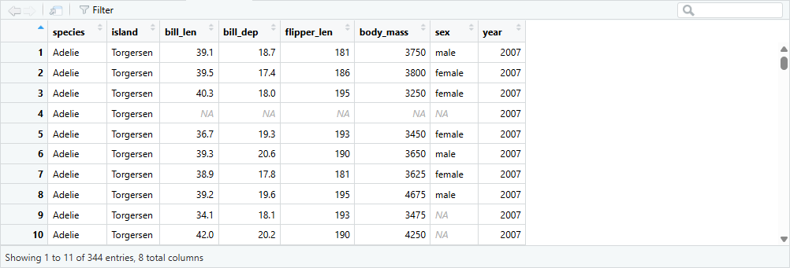
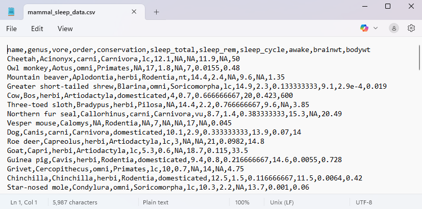

::: {.my-title}
# [Foundations of]{.my-subtitle}<br />[Data Science]{.blue}

::: {.my-grey}
[ | ]{}<br />
[Jeffrey M. Girard | Lecture ]{}
:::

{.absolute bottom=30 right=0 width="400"}
:::

```{r}
#| include: false
#| label: setup

library(here)
source(here("_common.R"))
```

## Roadmap

::: {.columns .pv4}

::: {.column width="60%"}
- Learn the principles of data storage and the tidy data format

- Read data from and write data to comma-separated values files
:::

::: {.column .tc .pv4 width="40%"}

:::

:::

# Principles

## Tidy Data Principles {.smaller}

::: {.columns .pv4}
::: {.column width="60%"}
- There are many ways to store data

::: {.fragment .mt1}
- We will be learning the [tidy data]{.b .blue} format
    - Data should be *rectangular*
    - Each [variable]{.green} has its own column
    - Each [observation]{.green} has its own row
    - Each [value]{.green} has its own cell
:::

::: {.fragment .mt1}

:::

:::

::: {.column .tc .pv5 width="40%"}

:::
:::


## Other Data Advice {.smaller}

::: {.columns .pv4}
::: {.column width="60%"}
-   [Name all variables]{.b .blue} in the first row
    -   This is called a [header row]{.b .green}
    
::: {.fragment .mt1}
-   [Avoid merged cells]{.b .blue} for data storage
    -   These are okay for communication
:::

::: {.fragment .mt1}
-   [Avoid empty cells]{.b .blue} whenever possible
    -   Mark [missing data]{.b .green} as `NA`
:::

::: {.fragment .mt1}
-   [Avoid formatting-as-data]{.b .blue} for storage
    -   e.g., non-redundant color-coding
:::
:::

::: {.column .tc .pv5 width="40%"}

:::
:::


## Tidying Example 1 {.smaller}

::: {.columns .pv4}
::: {.column width="45%"}
#### Not Tidy
<table class="table-bad" width="100%">
  <tbody>
  <tr>
    <td>Name</td>
    <td>Ann</td>
    <td>Bob</td>
    <td>Cat</td>
    <td>Dom</td>
  </tr>
  <tr>
    <td>Age</td>
    <td>13</td>
    <td>10</td>
    <td>11</td>
    <td>11</td>
  </tr>
  <tr>
    <td>Weight</td>
    <td>56.4</td>
    <td>46.8</td>
    <td>41.3</td>
    <td>43.3</td>
  </tr>
  </tbody>
</table>

::: {.fragment .mt1 .pv4}
❌ Here, each row is a variable and each column is an observation.
:::
:::

::: {.column width="10%"}
:::

::: {.column width="45%"}
::: {.fragment}
#### Tidy
<table class="table-good" width="100%">
  <tbody>
  <tr>
    <td>Name</td>
    <td>Age</td>
    <td>Weight</td>
  </tr>
  <tr>
    <td>Ann</td>
    <td>13</td>
    <td>56.4</td>
  </tr>
  <tr>
    <td>Bob</td>
    <td>10</td>
    <td>46.8</td>
  </tr>
  <tr>
    <td>Cat</td>
    <td>11</td>
    <td>41.3</td>
  </tr>
  <tr>
    <td>Dom</td>
    <td>11</td>
    <td>43.3</td>
  </tr>
  </tbody>
</table>
::: {.pv4}
✔️ Here, each column is a variable and each row is an observation.
:::
:::
:::
:::


## Tidying Example 2 {.smaller}

::: {.columns .pv4}
::: {.column width="45%"}
#### Not Tidy
<table class="table-bad" width="100%">
  <tbody>
  <tr>
    <td>Names:</td>
    <td>Ann</td>
    <td>Bob</td>
    <td>Cat</td>
    <td>Dom</td>
  </tr>
  <tr>
    <td>Age</td>
    <td>Weight</td>
    <td></td>
    <td></td>
    <td></td>
  </tr>
  <tr>
    <td>13</td>
    <td>56.4</td>
    <td></td>
    <td></td>
    <td></td>
  </tr>
  <tr>
    <td>10</td>
    <td>46.8</td>
    <td></td>
    <td></td>
    <td></td>
  </tr>
  <tr>
    <td>11</td>
    <td>41.3</td>
    <td></td>
    <td></td>
    <td></td>
  </tr>
  <tr>
    <td>11</td>
    <td>43.3</td>
    <td></td>
    <td></td>
    <td></td>
  </tr>
  </tbody>
</table>

::: {.fragment .mt1 .pv4}
❌ Here, we have data that is not rectangular because the Names variable has its own row.
:::
:::

::: {.column width="10%"}
:::

::: {.column width="45%"}
::: {.fragment}
#### Tidy
<table class="table-good" width="100%">
  <tbody>
  <tr>
    <td>Name</td>
    <td>Age</td>
    <td>Weight</td>
  </tr>
  <tr>
    <td>Ann</td>
    <td>13</td>
    <td>56.4</td>
  </tr>
  <tr>
    <td>Bob</td>
    <td>10</td>
    <td>46.8</td>
  </tr>
  <tr>
    <td>Cat</td>
    <td>11</td>
    <td>41.3</td>
  </tr>
  <tr>
    <td>Dom</td>
    <td>11</td>
    <td>43.3</td>
  </tr>
  </tbody>
</table>

::: {.pv4}
✔️ Here, we have made the data rectangular by moving the Names variable to its own column.
:::
:::
:::
:::


## Tidying Example 3 {.smaller}

::: {.columns .pv4}
::: {.column width="45%"}
#### Not Tidy
<table class="table-bad table-small" width="100%">
  <tbody>
  <tr>
    <td>country</td>
    <td>year</td>
    <td>cases / population</td>
  </tr>
  <tr>
    <td rowspan=2>Afghanistan</td>
    <td>1999</td>
    <td>NA / 19987071</td>
  </tr>
  <tr>
    <td>2000</td>
    <td>2666 / 20595360</td>
  </tr>
  <tr>
    <td rowspan=2>Brazil</td>
    <td>1999</td>
    <td>37737 / 172006362</td>
  </tr>
  <tr>
    <td>2000</td>
    <td>80488 / 174504898</td>
  </tr>
  <tr>
    <td rowspan=2>China</td>
    <td>1999</td>
    <td>212258 / 1272915272</td>
  </tr>
  <tr>
    <td>2000</td>
    <td>213766 / 1280428583</td>
  </tr>
  </tbody>
</table>

::: {.fragment .mt1 .pv4}
❌ Here, we have merged cells and two values stored in a single cell.
:::
:::

::: {.column width="10%"}
:::

::: {.column width="45%"}
::: {.fragment}
#### Tidy
<table class="table-good table-small" width="100%">
  <tbody>
  <tr>
    <td>country</td>
    <td>year</td>
    <td>cases</td>
    <td>population</td>
  </tr>
  <tr>
    <td>Afghanistan</td>
    <td>1999</td>
    <td>NA</td>
    <td>19987071</td>
  </tr>
  <tr>
    <td>Afghanistan</td>
    <td>2000</td>
    <td>2666</td>
    <td>20595360</td>
  </tr>
  <tr>
    <td>Brazil</td>
    <td>1999</td>
    <td>37737</td>
    <td>172006362</td>
  </tr>
  <tr>
    <td>Brazil</td>
    <td>2000</td>
    <td>80488</td>
    <td>174504898</td>
  </tr>
  <tr>
    <td>China</td>
    <td>1999</td>
    <td>212258</td>
    <td>1272915272</td>
  </tr>
  <tr>
    <td>China</td>
    <td>2000</td>
    <td>213766</td>
    <td>1280428583</td>
  </tr>
  </tbody>
</table>
::: {.pv4}
✔️ Here, we have un-merged the countries and separated the cases and populations variables into columns.
:::
:::
:::
:::


## Tidying Example 4 {.smaller}

::: {.columns .pv4}
::: {.column width="45%"}
#### Not Tidy
<table class="table-bad" width="100%">
  <tbody>
  <tr>
    <td>student</td>
    <td>grade</td>
    <td></td>
  </tr>
  <tr>
    <td>[Amber]{.bg-yellow}</td>
    <td>91.5</td>
    <td>A-</td>
  </tr>
  <tr>
    <td>[Bristol]{.bg-teal}</td>
    <td>86.2</td>
    <td>B</td>
  </tr>
  <tr>
    <td>[Charlene]{.bg-yellow}</td>
    <td>94.0</td>
    <td>A</td>
  </tr>
  <tr>
    <td>Diego</td>
    <td>89.3</td>
    <td>B+</td>
  </tr>
  <tr>
    <td colspan=3>Legend: [Psych. Major]{.bg-yellow}, [Psych. Minor]{.bg-teal}</td>
  </tr>
  </tbody>
</table>

::: {.fragment .mt1 .pv4}
❌ Here, we have a missing variable name and formatting-as-data.
:::
:::

::: {.column width="10%"}
:::

::: {.column width="45%"}
::: {.fragment}
#### Tidy
<table class="table-good" width="100%">
  <tbody>
  <tr>
    <td>student</td>
    <td>psych</td>
    <td>grade</td>
    <td>letter</td>
  </tr>
  <tr>
    <td>Amber</td>
    <td>major</td>
    <td>91.5</td>
    <td>A-</td>
  </tr>
  <tr>
    <td>Bristol</td>
    <td>minor</td>
    <td>86.2</td>
    <td>B</td>
  </tr>
  <tr>
    <td>Charlene</td>
    <td>major</td>
    <td>94.0</td>
    <td>A</td>
  </tr>
  <tr>
    <td>Diego</td>
    <td>NA</td>
    <td>89.3</td>
    <td>B+</td>
  </tr>
  </tbody>
</table>
::: {.pv4}
✔️ Here, we have added a column for the psych variable, removed the legend, and named the letter variable.
:::
:::
:::
:::


## Tidying Example 5 {.smaller}

::: {.columns .pv4}
::: {.column width="45%"}
#### Not Tidy
<table class="table-bad" width="100%">
  <tbody>
  <tr>
    <td>student</td>
    <td>grade</td>
    <td>letter</td>
  </tr>
  <tr>
    <td>Amber</td>
    <td>91.5</td>
    <td>A-</td>
  </tr>
  <tr>
    <td>Bristol*</td>
    <td>94.2</td>
    <td>A</td>
  </tr>
  <tr>
    <td colspan=3>Class Summary</td>
  </tr>
  <tr>
    <td>As</td>
    <td>2</td>
    <td>Yay!</td>
  </tr>
  <tr>
    <td>Bs</td>
    <td>0</td>
    <td></td>
  </tr>
  <tr>
    <td colspan=3 class="tr">*Grade was revised.</td>
  </tr>
  </tbody>
</table>

::: {.fragment .mt1 .pv4}
❌ Here, we have two types of data in one file and a footnote as data.
:::
:::

::: {.column width="10%"}
:::

::: {.column width="45%"}
::: {.fragment}
#### Tidy
<table class="table-good" width="100%">
  <tbody>
    <tr>
      <td>student</td>
      <td>grade</td>
      <td>letter</td>
      <td>revised</td>
    </tr>
    <tr>
      <td>Amber</td>
      <td>91.5</td>
      <td>A-</td>
      <td>FALSE</td>
    </tr>
    <tr>
      <td>Bristol</td>
      <td>94.2</td>
      <td>A</td>
      <td>TRUE</td>
    </tr>
  </tbody>
</table>

<table class="table-good" width="100%" style="margin-top: 1em;">
  <tbody>
    <tr>
      <td>letter</td>
      <td>count</td>
      <td>notes</td>
    </tr>
    <tr>
      <td>A</td>
      <td>2</td>
      <td>Yay!</td>
    </tr>
    <tr>
      <td>B</td>
      <td>0</td>
      <td></td>
    </tr>
  </tbody>
</table>

::: {.pv4}
✔️ Here, we have split the data into two separate tables and added the revised and notes variables.
:::
:::
:::
:::


# Data Files

## Data Files {.smaller}

::: {.columns .pv4}
::: {.column width="60%"}
-   Data is usually stored in [data files]{.b .green}
    -   Importing files into R is called [reading]{.b .blue}
    -   Exporting files from R is called [writing]{.b .blue}

::: {.fragment .mt1}
-   A convenient data file type is a CSV
    -   This stands for [comma-separated values]{.b .green}
    -   A CSV file is easy to share with other people
    
:::

::: {.fragment .mt1}
-   The [tidyverse]{.b .green} package can read/write CSVs
    -   The data will be stored in R as a [tibble]{.b .blue} object
    -   Other packages can read/write other file types
        
:::
:::

::: {.column .tc .pv5 width="40%"}

:::
:::

## Tibbles {.smaller}

::: {.columns .pv4}
::: {.column width="60%"}
-   R works particularly well with [tidy data]{.b .green}

::: {.fragment .mt1}
-   We store tidy data in [data frames]{.b .green} or [tibbles]{.b .blue}
    -   Tibbles are just fancier data frames<br />
        (i.e., they have a few extra features)
:::

::: {.fragment .mt1}
-   To use tibbles, we need the [tidyverse]{.b .blue} package
:::

::: {.fragment .mt1}
-   Tibbles are constructed from one or more vectors
    -   The vectors must have the [same length]{.b .green}
    -   They can contain [different types]{.b .green} of data
:::
:::

::: {.column .tc .pv5 width="40%"}

:::
:::

## Reading a CSV file into R

```{r}
#| echo: true
#| eval: true
#| message: false
#| replace_path: ["../../data/", ""]

library(tidyverse)
pdata <- read_csv("../../data/penguindata.csv") # Available on website
pdata
```

## Get the gist of the data with glimpse

```{r}
# This shows the first few values in each column (chr=strings, dbl=numbers)
glimpse(pdata)
```

## Dig deeper into the data with View

```{r}
#| eval: false

# This display is read-only. Data editing should be done by code, not by hand!
View(pdata)
```



## Accessing data from a package

```{r}
# Let's open the msleep data from the ggplot2 package
data("msleep", package = "ggplot2")
```

:::{.fragment}
```{r}
# Let's glimpse the tibble to learn about it
glimpse(msleep)
```
:::

## Writing data from R to a CSV file

```{r}
#| replace_path: ["../../data/", ""]

# Let's export this data so we can email it to someone without R
write_csv(msleep, file = "../../data/mammal_sleep_data.csv")
```


