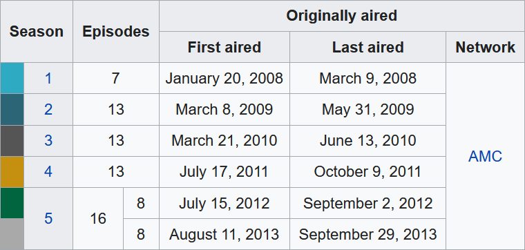

::: {.callout-caution title="Work in Progress"}
This page is still under development.
:::

```{r}
#| include: false
#| label: setup

library(here)
source(here("_common.R"))

knitr::opts_chunk$set(collapse = TRUE)
```

## [03a] Tidy Data / Data Files

### Topics
- Learn the principles of data storage and the tidy data format
- Read data from and write data to comma-separated values files

### File Downloads
- [penguindata.csv](../../data/penguindata.csv){download="penguindata.csv"}
- [cereal.csv](../../data/cereal.csv){download="cereal.csv"}

### Readings
- R4DS (2E) Section 1.2.1: [The penguins data frame](https://r4ds.hadley.nz/data-visualize.html#the-penguins-data-frame){target="_blank"}
- R4DS (2E) Section 5.1: [Data tidying - Introduction](https://r4ds.hadley.nz/data-tidy.html#introduction){target="_blank"}
- R4DS (2E) Section 5.2: [Tidy data](https://r4ds.hadley.nz/data-tidy.html#sec-tidy-data){target="_blank"}
- R4DS (2E) Section 7.2: [Reading data from a file](https://r4ds.hadley.nz/data-import.html#reading-data-from-a-file){target="_blank"}
- R4DS (2E) Section 7.5: [Writing to a file](https://r4ds.hadley.nz/data-import.html#sec-writing-to-a-file){target="_blank"}

### Slides
```{=html}
<iframe class="slide-deck" src="a_Slides.html" title="[02a] Slideshow">
</iframe>
```

::: {.fsmaller}
\*Note that you can click the three-line (hamburger) icon on the bottom-left of the slides to access a navigation menu. You can click inside the slides region and then press 'F' on your keyboard to view the slides full screen.
:::

### Practice
#### 1) Tidy Data

The following table summarizes the season information for the eight seasons of AMC's *Breaking Bad* show. 

a) Tidy up this data and save it to a tibble. Decide for yourself how to handle season 5 (should it be a single observation or two?). For the first and last aired dates, just store the year as a number.

b) Save the tibble you created to a CSV file in your Project folder named "breaking_bad.csv".




Version with one observation for the season five parts

```{r}
#| message: false

library(tidyverse)
season <- c(1, 2, 3, 4, 5)
episodes <- c(7, 13, 13, 13, 16)
first_air <- c(2008, 2009, 2010, 2011, 2012)
last_air <- c(2008, 2009, 2010, 2011, 2013)
network <- "AMC"
breaking_bad <- 
  tibble(season, episodes, first_air, last_air, network)

breaking_bad
```

Version with two separate observations for the season five parts

```{r}
library(tidyverse)
season <- c(1, 2, 3, 4, 5.1, 5.2)
episodes <- c(7, 13, 13, 13, 8, 8)
first_air <- c(2008, 2009, 2010, 2011, 2012, 2013)
last_air <- c(2008, 2009, 2010, 2011, 2012, 2013)
network <- "AMC"
breaking_bad <- 
  tibble(season, episodes, first_air, last_air, network)

breaking_bad
```

**Part (b)**

```{r}
#| eval: false

write_csv(breaking_bad, "breaking_bad.csv")
```



#### 2) Data Files

a) Click the link to download the [cereal.csv](../../data/cereal.csv){download="cereal.csv"} file and save it to your class Project folder.

b) Use \{tidyverse\} to import this file into R as a tibble named `cereal`. Then print it.

c) Use an R command to preview the data "at a glance." How many variables and observations are in this tibble?



**Part (b)**

```{r}
#| message: false
#| replace_path: ["../../data/", ""]

cereal <- read_csv("../../data/cereal.csv")
cereal
```

**Part (c)**

```{r}
#| collapse: true

glimpse(cereal)
```
77 observations (rows) and 8 variables (columns)




## [03b] Rows / Columns

### Topics
- Transform data by row using `arrange()`, `filter()`, and `distinct()`
- Transform data by column using `mutate()`, `select()`, `rename()`, and `relocate()`

### Readings
- R4DS (2E) Section 3.1: [Data Transformation - Introduction](https://r4ds.hadley.nz/data-transform.html#introduction){target="_blank"}
- R4DS (2E) Section 3.2: [Data Transformation - Rows](https://r4ds.hadley.nz/data-transform.html#rows){target="_blank"}
- R4DS (2E) Section 3.3: [Data Transformation - Columns](https://r4ds.hadley.nz/data-transform.html#columns){target="_blank"}

### Slides
```{=html}
<iframe class="slide-deck" src="b_Slides.html" title="[02b] Slideshow">
</iframe>
```

::: {.fsmaller}
\*Note that you can click the three-line (hamburger) icon on the bottom-left of the slides to access a navigation menu. You can click inside the slides region and then press 'F' on your keyboard to view the slides full screen.
:::

### Practice

For both sets of questions, load and use the `storms` dataset from the **dplyr** package. Because changes are only saved when using assignment, be sure to use the `<-` in each line. Then print the final result.

#### 1) Rows

a) Filter the `storms` dataset to show only the observations from the year **2005**. Sort the result by **pressure** from lowest to highest (ascending) to see the most intense observations first.

b) Use `distinct()` to find the unique **names** of all storms in the dataset that have ever reached **category 5**.



**Part (a)**

```{r}
#| message: false

library(tidyverse)
data("storms", package = "dplyr")

storms_2005 <- filter(storms, year == 2005)
storms_2005 <- arrange(storms_2005, pressure)
storms_2005
```

**Part (b)**

```{r}
storms_cat5 <- filter(storms, category == 5)
storms_cat5 <- distinct(storms_cat5, name)
storms_cat5
```



#### 2) Columns 

a) Create a subset of the `storms` dataset that contains only the **name**, **year**, and **wind** variables. Then, rename the **wind** column to **max_wind_knots**.

b) Create a new column called **wind_mph** (wind \* 1.15). Then, relocate this new column to appear immediately before the **pressure** column.



**Part (a)**

```{r}
storms_knots <- select(storms, name, year, wind)
storms_knots <- rename(storms_knots, max_wind_knots = wind)
storms_knots
```

**Part (b)**

```{r}
storms_mph <- mutate(storms, wind_mph = wind * 1.15)
storms_mph <- relocate(storms_mph, wind_mph, .before = pressure)
storms_mph
```



## [03c] Pipes / Pipelines

### Topics
- Use the pipe (`|>`) to efficiently pass an object to a function
- Build a pipeline by connecting multiple pipes together

### Readings
- R4DS (2E) Section 3.1.3: [dplyr basics](https://r4ds.hadley.nz/data-transform.html#dplyr-basics){target="_blank"}
- R4DS (2E) Section 3.4: [The pipe](https://r4ds.hadley.nz/data-transform.html#sec-the-pipe){target="_blank"}

### Slides
```{=html}
<iframe class="slide-deck" src="c_Slides.html" title="[02c] Slideshow">
</iframe>
```

::: {.fsmaller}
\*Note that you can click the three-line (hamburger) icon on the bottom-left of the slides to access a navigation menu. You can click inside the slides region and then press 'F' on your keyboard to view the slides full screen.
:::

### Practice

#### 1) Pipes

Q



A



#### 2) Pipelines

Q



A



<!-- Bottom Nav -->

```{=html}
<div style="display: flex; justify-content: space-between; margin-top: 3rem;">
  <a href="../03/index.html" class="btn btn-outline-primary" role="button">&laquo;&nbsp;&nbsp;Week 03</a>

  <a href="../04/index.html" class="btn btn-primary" role="button">Week 04&nbsp;&nbsp;&raquo;</a>
</div>
```
