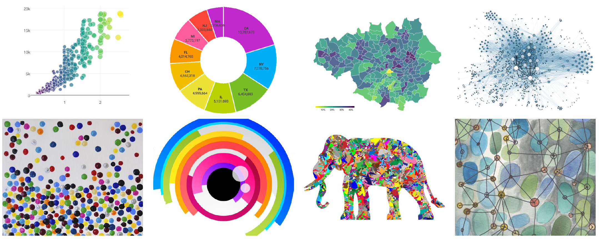
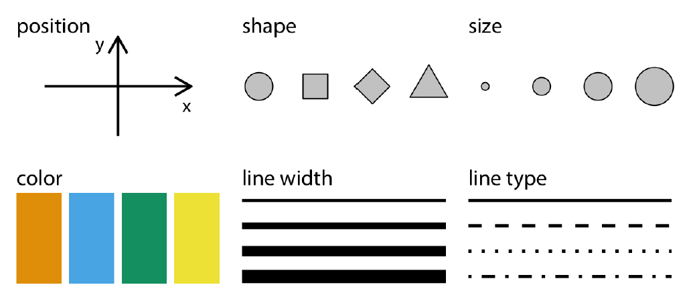
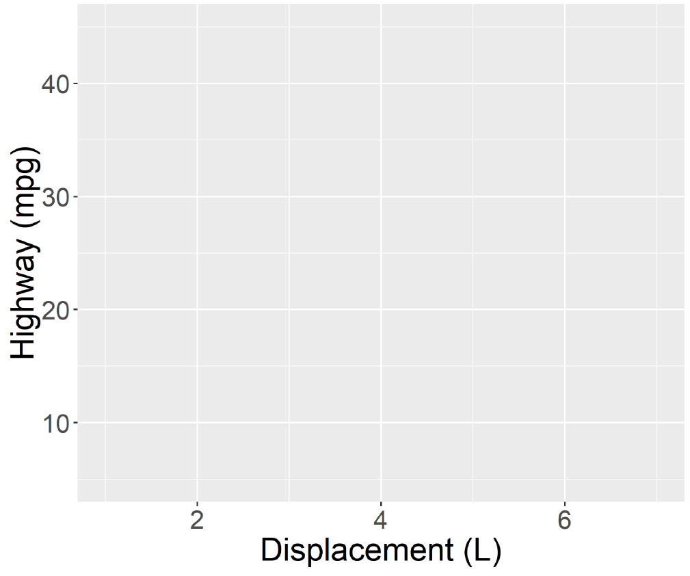
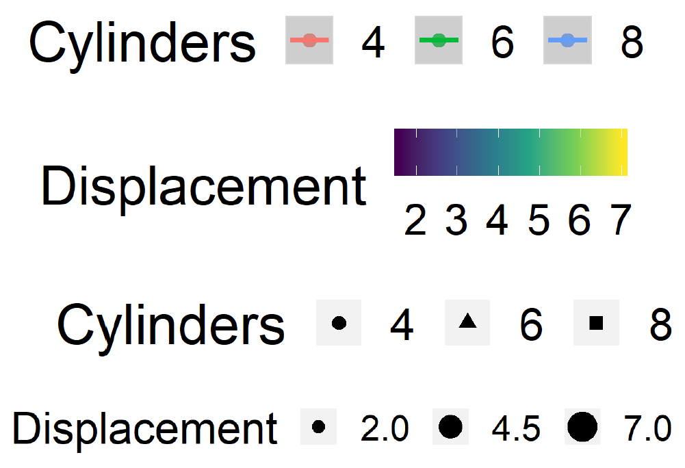
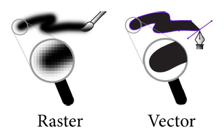
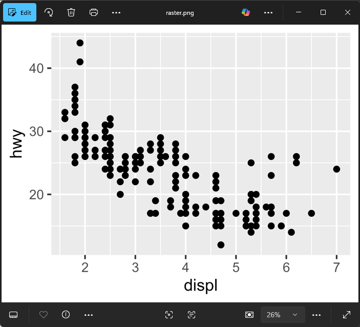
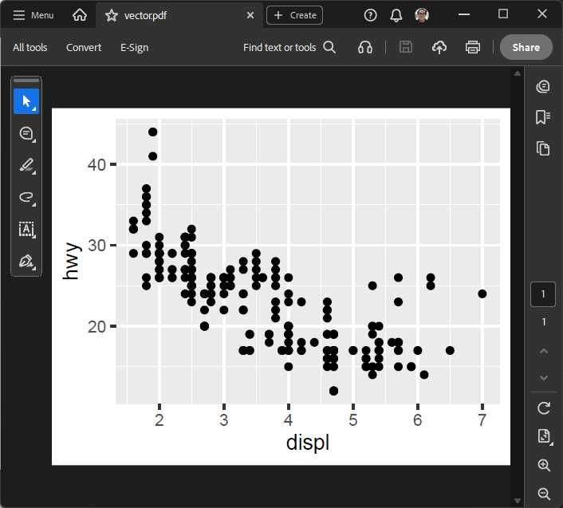
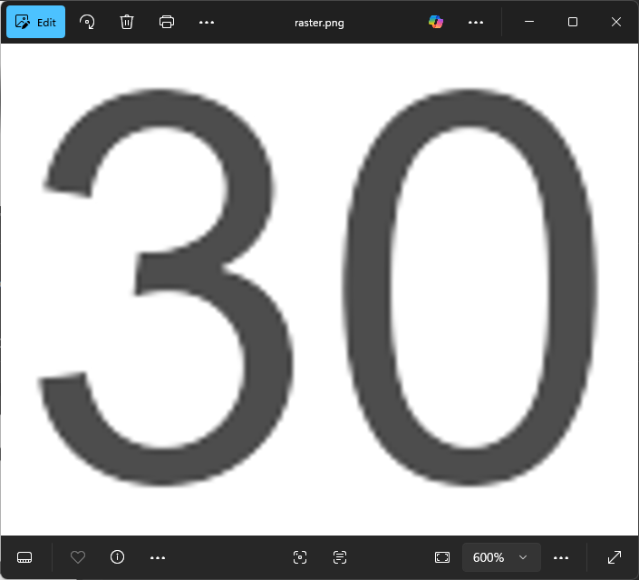
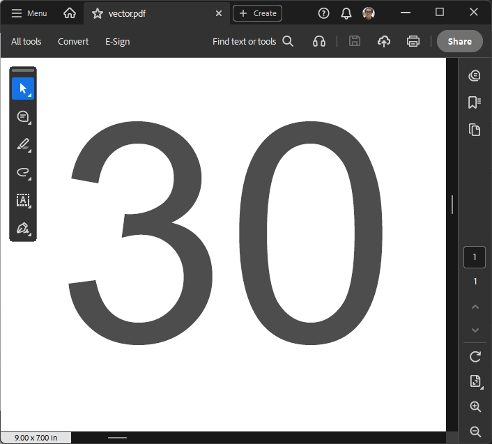

::: {.my-title}
# [Foundations of]{.my-subtitle} <br />[Data Science]{.blue}

::: {.my-grey}
[ | ]{}<br />
[Jeffrey M. Girard | Lecture ]{}
:::

{.absolute bottom=30 right=0 width="400"}
:::

```{r}
#| include: false
#| label: setup

library(here)
source(here("_common.R"))

library(tidyverse)
library(patchwork)

set_theme(theme_gray(base_size = 30))
```

## Roadmap

::: {.columns .pv4}

::: {.column width="60%"}
- Learn the principles that govern data visualization

- Create and save scatterplots using `ggplot()` and `ggsave()`
:::

::: {.column .tc .pv4 width="40%"}

:::

:::

# Principles

## What is a graphic? {.smaller}

::: {.pv4 .tc}


::: {.fragment}
A [data visualization]{.b .blue} expresses [data]{.b .green} through [visual aesthetics]{.b .green}.
:::
:::

## Describing Graphics {.smaller}

::: {.pv4 .tc}

```{r graphics1}
#| layout-ncol: 2
#| fig-height: 8
#| echo: false
#| message: false

mpg2 <- filter(mpg, cyl != 5)

ggplot(mpg2, aes(x = displ, y = hwy)) + 
  geom_point(size = 4) + 
  labs(x = "Engine Size", y = "MPG") + 
  theme_classic(base_size = 36)

ggplot(mpg2, aes(x = factor(cyl), y = hwy)) + 
  stat_summary(geom = "col", fun = mean) + 
  labs(x = "Cylinders", y = "Average MPG") + 
  theme_classic(base_size = 36)
```

::: {}
Some simple graphics are [easy to describe]{.b .green} and may even have [ready names]{.b .blue}.
:::
:::

## Describing Graphics {.smaller}

::: {.pv4 .tc}

```{r graphics2}
#| layout-ncol: 2
#| fig-height: 8
#| echo: false
#| message: false

ggplot(mpg2, aes(x = displ, y = hwy, color = factor(cyl))) + 
  geom_point(size = 4) + 
  geom_smooth(method = "lm", linewidth = 2) +
  labs(x = "Engine Size", y = "MPG", color = "Cylinders") + 
  theme_grey(base_size = 36) +
  theme(legend.position = "top")

ggplot(mpg2, aes(x = "0", y = hwy)) + 
  facet_wrap(~cyl) +
  geom_violin(size = 1) +
  geom_jitter(size = 3) +
  stat_summary(
    geom = "point", 
    fun = mean, 
    size = 12, 
    color = "red", 
    alpha = 0.8
  ) + 
  scale_x_discrete(position = "top") +
  labs(x = "Cylinders", y = "Average MPG") + 
  theme_grey(base_size = 36) +
  theme(
    axis.ticks.x = element_blank(),
    panel.grid.major.x = element_blank(),
    axis.text.x = element_blank()
  )
```

::: {.fragment}
A [grammar of graphics]{.b .blue} will help us describe more [complex]{.b .green} graphics.
:::
:::

## The Grammar of Graphics {.smaller}

::: {.columns .pv4}
::: {.column width="60%"}
-   The [grammar of graphics]{.b .blue} is a set of rules for [describing]{.b .green} and [creating]{.b .green} data visualizations

::: {.fragment .mt1}
-   To make our data visual (and therefore put our highly evolved occipital lobes to work)...
    -   We connect [variables]{.b .blue} to [visual qualities]{.b .green}
    -   We represent [observations]{.b .blue} as [visual objects]{.b .green}
:::

::: {.fragment .mt1}
-   This requires four *fundamental* elements
    -   We will first learn about them in lecture
    -   We will then apply them in R using \{ggplot2\}
:::
:::

::: {.column .tc .pv5 width="40%"}

:::
:::

## Data {.smaller}

::: {.tc .tibbledisp}

```{r mpg}
#| rows.print: 6

data("mpg", package = "ggplot2")
mpg
```

::: {.mt1}
Graphics require [data]{.b .blue} (e.g., tibbles), which describe [observations]{.b .green} using [variables]{.b .green}.
:::
:::

## Aesthetic Mappings {.smaller}

::: {.pv4 .tc}



::: {}
Graphics require [aesthetic mappings]{.b .blue}, which connect [data *variables*]{.b .green} to [visual *qualities*]{.b .green}.
:::
:::

## Scales {.smaller}

::: {.pv4 .tc}

::: {layout-ncol=2}



:::

::: {.mt1}
Graphics require [scales]{.b .blue}, which connect specific [data *values*]{.b .green} to specific [aesthetic *values*]{.b .green}.
:::
:::

## Geometric Objects {.smaller}

::: {.pv4 .tc}

```{r geoms}
#| layout-ncol: 2
#| fig-height: 8
#| echo: false
#| message: false

ggplot(mpg2, aes(x = displ, y = hwy)) + 
  geom_point(size = 4) + 
  labs(x = "Engine Size", y = "MPG") + 
  theme_grey(base_size = 36)

ggplot(mpg2, aes(x = factor(cyl), y = hwy)) + 
  stat_summary(geom = "col", fun = mean) + 
  labs(x = "Cylinders", y = "Average MPG") + 
  theme_grey(base_size = 36)
```

::: {.mt1}
Graphics require [geometric objects]{.b .blue} (geoms), which [represent the observations]{.b .green}.
:::
:::

# Scatterplots

## ggplot2 Basics {.smaller}

::: {.columns .pv4}
::: {.column width="60%"}
-   The [ggplot2]{.b .blue} package is a part of tidyverse
    -   No need to install or load it separately
    -   It plays nicely with tibbles and wrangling

::: {.fragment .mt1}
-   It implements the [grammar of graphics]{.b .green} in R
    -   The "gg" stands for "grammar of graphics"
    -   Thus, it lets us control all four elements
:::

::: {.fragment .mt1}
-   We will create a [pseudo-pipeline]{.b .green} of commands
    -   However, we will use `+` rather than `|>`
    -   This is because \{ggplot2\} predates the R pipe
:::
:::

::: {.column .tc .pv5 width="40%"}

:::
:::

## Starting with data

```{r}
#| output-location: column
#| fig-width: 7
#| fig-height: 7

library(tidyverse)

# CHECKLIST:
# [x] Element 1: data
# [ ] Element 2: mapping
# [ ] Element 3: scales (for free)
# [ ] Element 4: geoms

p <- 
  ggplot(
    data = mpg
  )
p
```

## Adding aesthetic mapping

```{r}
#| output-location: column
#| fig-width: 7
#| fig-height: 7

# CHECKLIST:
# [x] Element 1: data
# [x] Element 2: mapping
# [x] Element 3: scales (for free)
# [ ] Element 4: geoms

p <- 
  ggplot(
    data = mpg,
    mapping = aes(x = displ, y = hwy)
  )
p
```

## Adding geometric objects

```{r}
#| output-location: column
#| fig-width: 7
#| fig-height: 7

# CHECKLIST:
# [x] Element 1: data
# [x] Element 2: mapping
# [x] Element 3: scales (for free)
# [x] Element 4: geoms

p <- 
  ggplot(
    data = mpg,
    mapping = aes(x = displ, y = hwy)
  ) +
  geom_point()
p
```

## Compact (Positional) Coding

```{r}
#| fig-height: 7

ggplot(mpg, aes(x = displ, y = hwy)) + geom_point()
```

# Saving Graphics

## Saving Graphics {.smaller}

::: {.columns .pv4}

::: {.column width="60%"}
-   `ggsave()` exports ggplots to files
    -   We control the exact size and format
    
::: {.fragment .mt1}
-   [Raster]{.b .blue} ([png]{.b}, jpg, bmp, tif): Compatibility

    
::: {.mt1}
-   [Vector]{.b .blue} ([pdf]{.b}, svg, wmf, eps): Scalability
:::



:::
:::

::: {.column .tc .pv4 width="40%"}

:::
:::

## Using the ggsave function

```{r}
# Prepare a graphic and assign it to an object (p)
p <- ggplot(mpg, aes(x = displ, y = hwy)) + geom_point()
```

:::{.columns}
:::{.column}
```{r}
# Save to a raster (png) file
ggsave(
  filename = "raster.png",
  plot = p,
  width = 9,
  height = 7,
  units = "in"
)
```
:::
:::{.column}
```{r}
# Save to a vector (pdf) file
ggsave(
  filename = "vector.pdf",
  plot = p,
  width = 9,
  height = 7,
  units = "in"
)
```
:::
:::

## Comparing the output (full size)

:::{.columns}
:::{.column}


raster.png - 172.1 KB
:::
:::{.column}


vector.pdf - 11.2 KB
:::
:::

## Comparing the output (zoomed in)

:::{.columns}
:::{.column}


raster.png - 172.1 KB
:::
:::{.column}


vector.pdf - 11.2 KB
:::
:::
