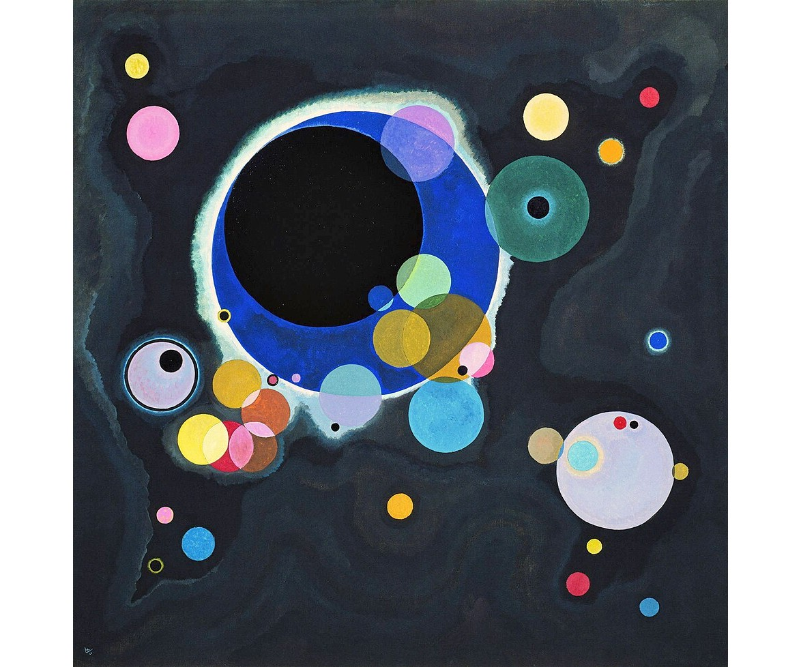
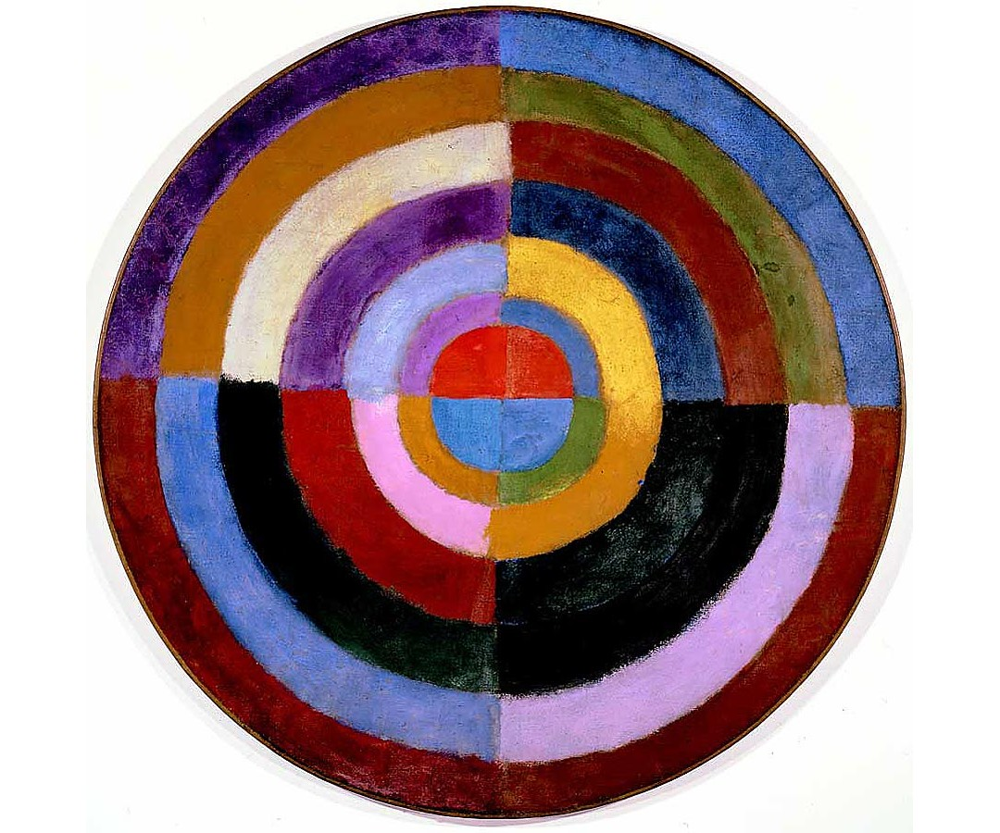
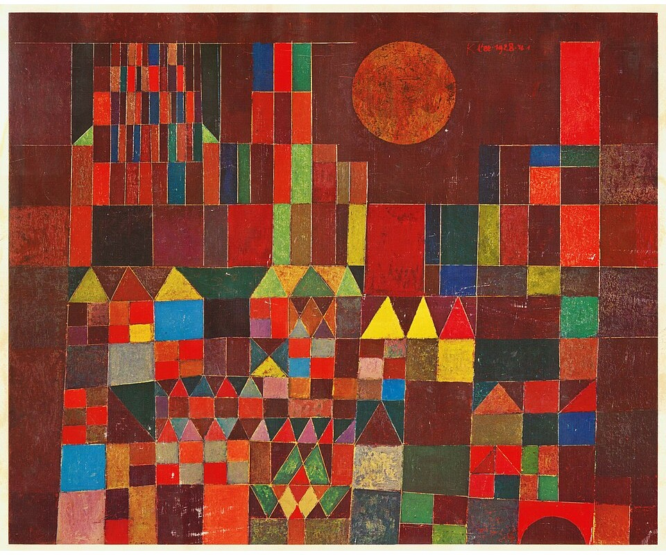
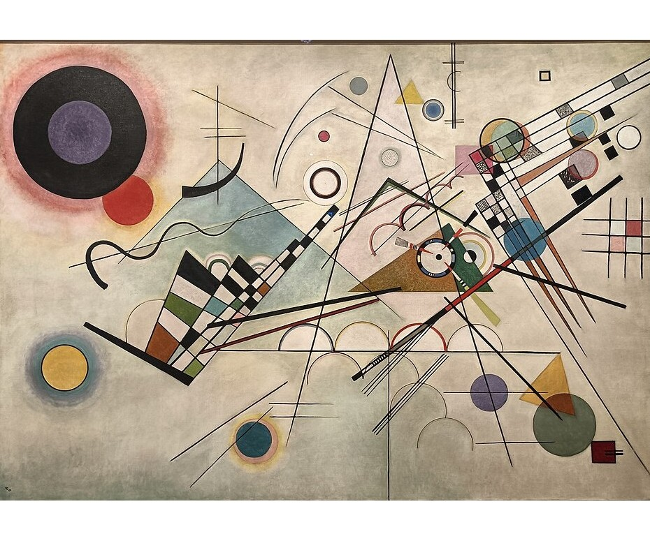

::: {.my-title}
# [Foundations of]{.my-subtitle} <br />[Data Science]{.blue}

::: {.my-grey}
[ | ]{}<br />
[Jeffrey M. Girard | Lecture ]{}
:::

{.absolute bottom=30 right=0 width="400"}
:::

```{r}
#| include: false
#| label: setup

library(here)
source(here("_common.R"))

library(tidyverse)
library(patchwork)

set_theme(theme_gray(base_size = 30))
```

## Roadmap

::: {.columns .pv4}

::: {.column width="60%"}
- Learn the principles that govern data visualization

- Create and save scatterplots using `ggplot()` and `ggsave()`
:::

::: {.column .tc .pv4 width="40%"}

:::

:::

# Principles

## What is a graphic? {.fs70}

<!-- no .pv4 here: this slide carries two full rows of figures, and 4rem of
     vertical padding is what pushed it 50px past the canvas. -->
::: {.tc}
```{r}
#| echo: false
#| fig-width: 12
#| fig-height: 2.5

# The top row of this slide is four real visualizations of real data; the bottom
# row (four public-domain paintings, in the markup below) borrows each one's form
# while encoding nothing. The columns are paired deliberately -- bubbles, rings,
# patches, node-and-link -- because the contrast is the point the slide makes.
library(nycflights13)
blank <- theme_void() + theme(legend.position = "none",
                              plot.margin = margin(2, 3, 2, 3))

# -- 1. scatter: fuel economy against engine size ----------------------------
p1 <- ggplot(mpg, aes(displ, hwy, colour = cty)) +
  geom_point(size = 1.9, alpha = .85,
             position = position_jitter(.06, .3, seed = 1)) +
  scale_colour_viridis_c() + blank

# -- 2. donut: how the same cars divide into classes -------------------------
dn <- count(mpg, class) |>
  mutate(f = n / sum(n), ymax = cumsum(f), ymin = lag(ymax, default = 0))
p2 <- ggplot(dn, aes(ymin = ymin, ymax = ymax, xmin = 3, xmax = 4, fill = class)) +
  geom_rect(colour = "white", linewidth = .4) +
  coord_polar(theta = "y") + xlim(1.4, 4) +
  scale_fill_brewer(palette = "Set2") + blank

# -- 3. choropleth: murder arrests per 100,000, by state ---------------------
arrests <- tibble(region = tolower(rownames(USArrests)), murder = USArrests$Murder)
p3 <- ggplot(left_join(map_data("state"), arrests, by = "region"),
             aes(long, lat, group = group, fill = murder)) +
  geom_polygon(colour = "white", linewidth = .12) +
  coord_quickmap() + scale_fill_viridis_c() + blank

# -- 4. network: 2013 flights out of the three NYC airports ------------------
pos <- select(airports, faa, lat, lon)
routes <- count(flights, origin, dest) |>
  left_join(pos, by = c("origin" = "faa")) |> rename(y1 = lat, x1 = lon) |>
  left_join(pos, by = c("dest" = "faa")) |> rename(y2 = lat, x2 = lon) |>
  filter(!is.na(x2), between(x2, -126, -67), between(y2, 25, 49))
p4 <- ggplot() +
  geom_segment(data = routes, aes(x1, y1, xend = x2, yend = y2, linewidth = n),
               colour = "#2E75B6", alpha = .3) +
  geom_point(data = distinct(routes, dest, x2, y2), aes(x2, y2),
             colour = "#1F4E79", size = 1.5) +
  scale_linewidth(range = c(.15, 1.1)) + coord_quickmap() + blank

p1 | p2 | p3 | p4
```

::: {layout-ncol=4}







:::

::: {.fragment}
A [data visualization]{.b .blue} expresses [data]{.b .green} through [visual aesthetics]{.b .green}.
:::
:::

## Describing Graphics {.fs70}

::: {.pv4 .tc}

```{r graphics1}
#| layout-ncol: 2
#| fig-height: 7
#| echo: false
#| message: false

mpg2 <- filter(mpg, cyl != 5)

ggplot(mpg2, aes(x = displ, y = hwy)) + 
  geom_point(size = 4) + 
  labs(x = "Engine Size", y = "MPG") + 
  theme_classic(base_size = 36)

ggplot(mpg2, aes(x = factor(cyl), y = hwy)) + 
  stat_summary(geom = "col", fun = mean) + 
  labs(x = "Cylinders", y = "Average MPG") + 
  theme_classic(base_size = 36)
```

::: {}
Some simple graphics are [easy to describe]{.b .green} and may even have [ready names]{.b .blue}.
:::
:::

## Describing Graphics {.fs70}

::: {.pv4 .tc}

```{r graphics2}
#| layout-ncol: 2
#| fig-height: 7
#| echo: false
#| message: false

ggplot(mpg2, aes(x = displ, y = hwy, color = factor(cyl))) + 
  geom_point(size = 4) + 
  geom_smooth(method = "lm", linewidth = 2) +
  labs(x = "Engine Size", y = "MPG", color = "Cylinders") + 
  theme_grey(base_size = 36) +
  theme(legend.position = "top")

ggplot(mpg2, aes(x = "0", y = hwy)) + 
  facet_wrap(~cyl) +
  geom_violin(linewidth = 1) +
  geom_jitter(size = 3) +
  stat_summary(
    geom = "point", 
    fun = mean, 
    size = 12, 
    color = "red", 
    alpha = 0.8
  ) + 
  scale_x_discrete(position = "top") +
  labs(x = "Cylinders", y = "Average MPG") + 
  theme_grey(base_size = 36) +
  theme(
    axis.ticks.x = element_blank(),
    panel.grid.major.x = element_blank(),
    axis.text.x = element_blank()
  )
```

::: {.fragment}
A [grammar of graphics]{.b .blue} will help us describe more [complex]{.b .green} graphics.
:::
:::

## The Grammar of Graphics {.fs70}

::: {.columns .pv4}
::: {.column width="60%"}
-   The [grammar of graphics]{.b .blue} is a set of rules for [describing]{.b .green} and [creating]{.b .green} data visualizations

::: {.fragment .mt1}
-   To make our data visual (and therefore put our highly evolved occipital lobes to work)...
    -   We connect [variables]{.b .blue} to [visual qualities]{.b .green}
    -   We represent [observations]{.b .blue} as [visual objects]{.b .green}
:::

::: {.fragment .mt1}
-   This requires four *fundamental* elements
    -   We will first learn about them in lecture
    -   We will then apply them in R using \{ggplot2\}
:::
:::

::: {.column .tc .pv5 width="40%"}

:::
:::

## Data {.fs70}

::: {.tc .tibbledisp}

```{r mpg}
#| rows.print: 6

data("mpg", package = "ggplot2")
mpg
```

::: {.mt1}
Graphics require [data]{.b .blue} (e.g., tibbles), which describe [observations]{.b .green} using [variables]{.b .green}.
:::
:::

## Aesthetic Mappings {.fs70 .figfit}

::: {.pv4 .tc}

```{r}
#| echo: false
#| fig-width: 9
#| fig-height: 4.1

# The six aesthetics ggplot lets you map a variable onto. Each panel shows the
# aesthetic varying on its own, with nothing mapped -- the point is the vocabulary,
# not a dataset. theme_void() resets base_size, so sizes here are set explicitly.
pane <- function(ttl) {
  list(theme_void(base_size = 20),
       theme(plot.title = element_text(size = 20, hjust = 0, margin = margin(b = 6)),
             plot.margin = margin(6, 12, 6, 12),
             legend.position = "none"))
}

p_pos <- ggplot(tibble(x = c(-1, 0), y = c(0, -1), xe = c(1, 0), ye = c(0, 1))) +
  geom_segment(aes(x, y, xend = xe, yend = ye), linewidth = .7,
               arrow = arrow(length = unit(.22, "cm"), type = "closed")) +
  annotate("text", x = 1.02, y = -.22, label = "x", size = 6) +
  annotate("text", x = -.22, y = 1.02, label = "y", size = 6) +
  coord_equal(xlim = c(-1.3, 1.3), ylim = c(-1.3, 1.3)) +
  labs(title = "position") + pane()

# No coord_equal on these two: every point sits at y = 0, so the data y-range is
# zero and a fixed aspect ratio stretches the panel to a sliver. Set limits instead.
p_shape <- ggplot(tibble(x = 1:4, s = c(21, 22, 23, 24)), aes(x, 0, shape = s)) +
  geom_point(size = 11, fill = "grey72", stroke = .7) +
  scale_shape_identity() +
  scale_x_continuous(limits = c(.4, 4.6)) +
  scale_y_continuous(limits = c(-1, 1)) +
  labs(title = "shape") + pane()

p_size <- ggplot(tibble(x = 1:4, s = c(4, 7, 10, 13)), aes(x, 0, size = s)) +
  geom_point(shape = 21, fill = "grey72", stroke = .7) +
  scale_size_identity() +
  scale_x_continuous(limits = c(.4, 4.6)) +
  scale_y_continuous(limits = c(-1, 1)) +
  labs(title = "size") + pane()

p_col <- ggplot(tibble(x = 1:4, k = c("#E08E0B", "#4FA3E3", "#12946B", "#EFDC33")),
                aes(x, 0, fill = k)) +
  geom_tile(width = .85, height = 1.8) + scale_fill_identity() +
  labs(title = "color") + pane()

p_lw <- ggplot(tibble(y = 4:1, w = c(.5, 1.2, 2.1, 3.2))) +
  geom_segment(aes(x = 0, xend = 1, y = y, yend = y, linewidth = w)) +
  scale_linewidth_identity() + labs(title = "line width") + pane()

p_lt <- ggplot(tibble(y = 4:1, t = c("solid", "dashed", "dotted", "dotdash"))) +
  geom_segment(aes(x = 0, xend = 1, y = y, yend = y, linetype = t), linewidth = .8) +
  scale_linetype_identity() + labs(title = "line type") + pane()

(p_pos | p_shape | p_size) / (p_col | p_lw | p_lt)
```

::: {}
Graphics require [aesthetic mappings]{.b .blue}, which connect [data *variables*]{.b .green} to [visual *qualities*]{.b .green}.
:::
:::

## Scales {.fs70 .figfit}

::: {.pv4 .tc}

::: {layout-ncol=2}


:::

::: {.mt1}
Graphics require [scales]{.b .blue}, which connect specific [data *values*]{.b .green} to specific [aesthetic *values*]{.b .green}.
:::
:::

## Geometric Objects {.fs70}

::: {.pv4 .tc}

```{r geoms}
#| layout-ncol: 2
#| fig-height: 7
#| echo: false
#| message: false

ggplot(mpg2, aes(x = displ, y = hwy)) + 
  geom_point(size = 4) + 
  labs(x = "Engine Size", y = "MPG") + 
  theme_grey(base_size = 36)

ggplot(mpg2, aes(x = factor(cyl), y = hwy)) + 
  stat_summary(geom = "col", fun = mean) + 
  labs(x = "Cylinders", y = "Average MPG") + 
  theme_grey(base_size = 36)
```

::: {.mt1}
Graphics require [geometric objects]{.b .blue} (geoms), which [represent the observations]{.b .green}.
:::
:::

# Scatterplots

## ggplot2 Basics {.fs70}

::: {.columns .pv4}
::: {.column width="60%"}
-   The [ggplot2]{.b .blue} package is a part of tidyverse
    -   No need to install or load it separately
    -   It plays nicely with tibbles and wrangling

::: {.fragment .mt1}
-   It implements the [grammar of graphics]{.b .green} in R
    -   The "gg" stands for "grammar of graphics"
    -   Thus, it lets us control all four elements
:::

::: {.fragment .mt1}
-   We will create a [pseudo-pipeline]{.b .green} of commands
    -   However, we will use `+` rather than `|>`
    -   This is because \{ggplot2\} predates the R pipe
:::
:::

::: {.column .tc .pv5 width="40%"}

:::
:::

## Starting with data

```{r}
#| output-location: column
#| echo: true
#| fig-width: 7
#| fig-height: 7

library(tidyverse)

# CHECKLIST:
# [x] Element 1: data
# [ ] Element 2: mapping
# [ ] Element 3: scales (for free)
# [ ] Element 4: geoms

p <- 
  ggplot(
    data = mpg
  )
p
```

## Adding aesthetic mapping

```{r}
#| output-location: column
#| echo: true
#| fig-width: 7
#| fig-height: 7

# CHECKLIST:
# [x] Element 1: data
# [x] Element 2: mapping
# [x] Element 3: scales (for free)
# [ ] Element 4: geoms

p <- 
  ggplot(
    data = mpg,
    mapping = aes(x = displ, y = hwy)
  )
p
```

## Adding geometric objects

```{r}
#| output-location: column
#| echo: true
#| fig-width: 7
#| fig-height: 7

# CHECKLIST:
# [x] Element 1: data
# [x] Element 2: mapping
# [x] Element 3: scales (for free)
# [x] Element 4: geoms

p <- 
  ggplot(
    data = mpg,
    mapping = aes(x = displ, y = hwy)
  ) +
  geom_point()
p
```

## Compact (Positional) Coding

```{r}
#| fig-height: 7

ggplot(mpg, aes(x = displ, y = hwy)) + geom_point()
```

# Saving Graphics

## Saving Graphics {.fs70}

::: {.columns .pv4}

::: {.column width="60%"}
-   `ggsave()` exports ggplots to files
    -   We control the exact size and format
    
::: {.fragment .mt1}
-   [Raster]{.b .blue} ([png]{.b}, jpg, bmp, tif): Compatibility

    
::: {.mt1}
-   [Vector]{.b .blue} ([pdf]{.b}, svg, wmf, eps): Scalability
:::

```{r}
#| echo: false
#| fig-width: 6
#| fig-height: 2.3

# The same shape stored both ways: on the left as a fixed grid of pixels, on the
# right as the outline itself. Zooming in on the left finds the squares; zooming
# in on the right just re-evaluates the curve, which is the whole argument for
# vector formats.
outline <- function(n = 400) {
  a <- seq(0, 2 * pi, length.out = n)
  r <- 1 + .28 * sin(3 * a) + .16 * cos(2 * a)
  tibble(a = a, x = r * cos(a), y = r * sin(a))
}
inside <- function(x, y) {
  a <- atan2(y, x)
  sqrt(x^2 + y^2) <= 1 + .28 * sin(3 * a) + .16 * cos(2 * a)
}

px <- expand_grid(x = seq(-1.4, 1.4, length.out = 15),
                  y = seq(-1.4, 1.4, length.out = 15)) |>
  filter(inside(x, y))

shell <- theme_void(base_size = 18) +
  theme(plot.title = element_text(size = 18, hjust = .5, margin = margin(b = 4)),
        plot.margin = margin(4, 8, 4, 8))

p_raster <- ggplot(px, aes(x, y)) +
  geom_tile(width = .2, height = .2, fill = "grey25", colour = "white",
            linewidth = .3) +
  coord_equal(xlim = c(-1.5, 1.5), ylim = c(-1.5, 1.5)) +
  labs(title = "Raster") + shell

p_vector <- ggplot(outline(), aes(x, y)) +
  geom_polygon(fill = "grey25") +
  geom_point(data = outline(19), colour = "#0197F6", size = 1.4) +
  coord_equal(xlim = c(-1.5, 1.5), ylim = c(-1.5, 1.5)) +
  labs(title = "Vector") + shell

p_raster | p_vector
```

:::
:::

::: {.column .tc .pv4 width="40%"}

:::
:::

## Using the ggsave function

```{r}
# Prepare a graphic and assign it to an object (p)
p <- ggplot(mpg, aes(x = displ, y = hwy)) + geom_point()
```

:::{.columns}
:::{.column}
```{r}
# Save to a raster (png) file
ggsave(
  filename = "raster.png",
  plot = p,
  width = 9,
  height = 7,
  units = "in"
)
```
:::
:::{.column}
```{r}
# Save to a vector (pdf) file
ggsave(
  filename = "vector.pdf",
  plot = p,
  width = 9,
  height = 7,
  units = "in"
)
```
:::
:::

## Comparing the output (full size)

:::{.columns}
:::{.column}


raster.png - 172.1 KB
:::
:::{.column}


vector.pdf - 11.2 KB
:::
:::

## Comparing the output (zoomed in)

:::{.columns}
:::{.column}


raster.png - 172.1 KB
:::
:::{.column}


vector.pdf - 11.2 KB
:::
:::
