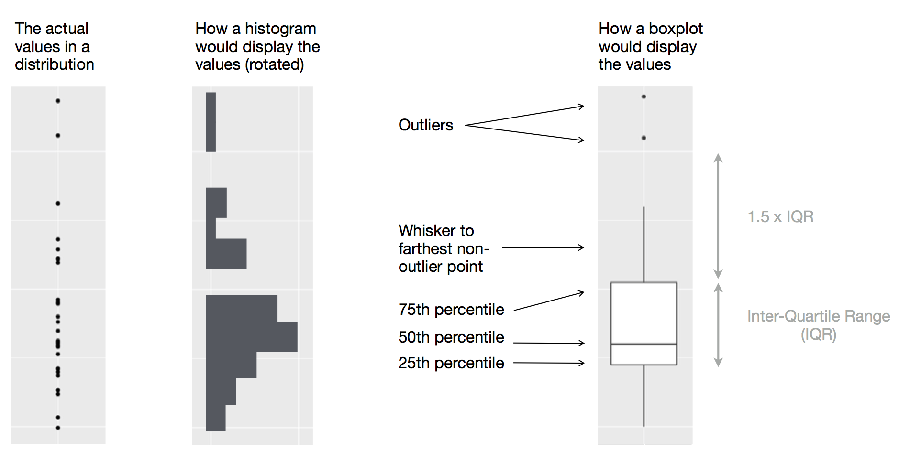

::: {.my-title}
# [Foundations of]{.my-subtitle}<br />[Data Science]{.blue}

::: {.my-grey}
[ | ]{}<br />
[Jeffrey M. Girard | Lecture ]{}
:::

{.absolute bottom=30 right=0 width="400"}
:::

```{r}
#| include: false
#| message: false
#| label: setup

library(here)
source(here("_common.R"))

library(tidyverse)
theme_set(theme_gray(base_size = 30))
```

## Roadmap

::: {.columns .pv4}

::: {.column width="60%"}
- Visualize the distribution of a single variable

- Visualize the relationship between two variables
:::

::: {.column .tc .pv4 width="40%"}

:::

:::

## Setup

```{r}
#| message: false

library(tidyverse)
data("penguins", package = "datasets")

glimpse(penguins)
```


# Distributions

## Visualizing Distributions {.smaller}

::: {.columns .pv4}
::: {.column width="60%"}
-   Variable [distributions]{.b .blue} are critical in data analysis
    -   What are the most and least [common values]{.b}?
    -   What are the [extrema]{.b} (min and max values)?
    -   Are there any [outliers]{.b} or impossible values?
    -   How much [spread]{.b} is there in the variable?
    -   What [shape]{.b} does the distribution take?

::: {.fragment .mt1}
-   Visualization helps us to understand [variation]{.b .green}
    -   It can also [communicate]{.b} it to others
    -   The geom chosen depends on whether the variable is [discrete]{.b} or [continuous]{.b}
    
:::
:::

::: {.column .tc .pv5 width="40%"}

:::
:::

## Common Strategies

- **One [Discrete]{.blue} $\rightarrow$ [Bar]{.green}**
    + Count each category's occurrence
    + x = Discrete Categories, y = Count
- **One [Continuous]{.blue} $\rightarrow$ [Histogram]{.green}**
    + Cut the variable's range into discrete "bins"
    + Count each bin's occurrence
    + x = Variable Values, y = Count

# Bar Chart

## Species Bar Chart

```{r}
penguins |>                   # start with penguins, pipe to pass tibble
  ggplot(aes(x = species)) +  # map x-axis to species, plus to add to plot
  geom_bar()                  # bar to plot category counts
```

## Species Interpretation

:::{.columns}
:::{.column}
```{r}
#| echo: false
#| fig-height: 9
#| fig-width: 9
penguins |> ggplot(aes(x = species)) + geom_bar()
```
:::
:::{.column .fragment}
- Three species were observed
- Adelie was most common, then Gentoo, then Chinstrap
- Adelies were observed twice as often as Chinstraps
- Are unequal frequencies expected? Problematic?
:::
:::

## Sex Bar Chart

```{r}
penguins |>               # start with penguins, pipe to pass tibble
  ggplot(aes(x = sex)) +  # map x-axis to sex, plus to add to plot
  geom_bar()              # bar to plot category counts
```

## Sex Interpretation

:::{.columns}
:::{.column}
```{r}
#| echo: false
#| fig-height: 9
#| fig-width: 9

penguins |> ggplot(aes(x = sex)) + geom_bar() 
```
:::
:::{.column .fragment}
- Males were slightly more common than Females
- Around 10 observations are missing sex info (NA)
- Are these NAs: expected? problematic? fixable?
:::
:::

## Bar Missing Values

```{r}
penguins |>               # start with penguins, pipe to pass tibble
  drop_na(sex) |>         # drop NAs in sex, pipe to pass tibble
  ggplot(aes(x = sex)) +  # map x-axis to sex, plus to add to plot
  geom_bar()              # bar to plot category counts
```

# Histogram

## Mass Histogram

```{r}
#| warning: false

penguins |>                     # start with penguins, pipe to pass tibble
  ggplot(aes(x = body_mass)) +  # map x-axis to body_mass, plus to add to plot
  geom_histogram()              # histogram to plot bin counts
```

## Mass Interpretation

:::{.columns}
:::{.column}
```{r}
#| echo: false
#| fig-height: 9
#| fig-width: 9

penguins |> ggplot(aes(x = body_mass)) + geom_histogram()
```
:::
:::{.column .fragment}
- Body mass ranged from around 2500 to around 6500
- Most values were between 3250 and 4000
- Values from 4000 to 5750 were also pretty common
- At a glance, no values seem impossible or erroneous
:::
:::

## Histogram Bins

:::{.columns}
:::{.column}
```{r}
#| warning: false
#| fig-height: 6
#| fig-width: 7

# break x range into 20 bins
penguins |>
  ggplot(aes(x = body_mass)) +
  geom_histogram(bins = 20)
```

:::
:::{.column}
```{r}
#| warning: false
#| fig-height: 6
#| fig-width: 7

# break x range into 4 bins
penguins |>
  ggplot(aes(x = body_mass)) +
  geom_histogram(bins = 4)
```
:::
:::

## Histogram Binwidth

:::{.columns}
:::{.column}
```{r}
#| warning: false
#| fig-height: 6
#| fig-width: 7

# each bin is 20 x-units wide
penguins |>
  ggplot(aes(x = body_mass)) +
  geom_histogram(binwidth = 20)
```

:::
:::{.column}
```{r}
#| warning: false
#| fig-height: 6
#| fig-width: 7

# each bin is 2000 x-units wide
penguins |>
  ggplot(aes(x = body_mass)) +
  geom_histogram(binwidth = 2000)
```
:::
:::

# Relationships

## Visualizing Relationships {.smaller}

::: {.columns .pv4}
::: {.column width="60%"}
-   We are often interested in variable [relationships]{.b .blue}
    -   Does variation in X go with variation in Y?
    -   Do higher X scores go with higher Y scores?
    -   Do groups differ on Y score distributions?
    -   Do certain groups tend to go together?

::: {.fragment .mt1}
-   We can extend variation geoms into [covariation]{.b .blue}
    -   The geoms we use will heavily depend on...
    -   ...are the variables [continuous]{.b .green} or [discrete]{.b .green}?
    
:::
:::

::: {.column .tc .pv5 width="40%"}

:::
:::

## Common Strategies {.fsmaller}

- **[Two Continuous]{.blue} $\rightarrow$ [Point]{.green}**
    + Use two positional axes
    + x = Variable 1 Values, y = Variable 2 Values
- **[One Discrete, One Continuous]{.blue} $\rightarrow$ [Boxplot]{.green}**
    + Use one positional axis and boxes-and-whiskers
    + x = Discrete Categories, y = Continuous Values
- **[Two Discrete]{.blue} $\rightarrow$ [Bar (with fill)]{.green}**
    + Use stacked-and-colored bars to show proportions
    + x = Variable 1 Categories, y = Counts, fill = Variable 2 Categories

# Scatterplot

## Flipper--Mass Scatterplot

```{r}
#| warning: false

penguins |> ggplot(aes(x = flipper_len, y = body_mass)) + geom_point()
```

## Flipper--Mass Interpretation

:::{.columns}
:::{.column}
```{r}
#| echo: false
#| fig-height: 9
#| fig-width: 9

penguins |> ggplot(aes(x = flipper_len, y = body_mass)) + geom_point()
```
:::
:::{.column .fragment}
- As flipper length increases, body mass also increases
- This relationship looks linear (as in a straight line)
- However, there is some spread around that line
- There seem to be more penguins with low body mass and low flipper length
:::
:::

# Boxplot

## How to read a boxplot



## Species--Mass Boxplot

```{r}
#| warning: false

penguins |> ggplot(aes(x = species, y = body_mass)) + geom_boxplot()
```

## Species--Mass Interpretation

:::{.columns}
:::{.column}
```{r}
#| echo: false
#| fig-height: 9
#| fig-width: 9

penguins |> ggplot(aes(x = species, y = body_mass)) + geom_boxplot()
```
:::
:::{.column .fragment}
- Adelies and Chinstraps have similar mass distributions
- There are outlier Chinstraps
- Gentoos tend to be larger than Adelies \& Chinstraps
- There is overlap: large Adelies \& Chinstraps are larger than small Gentoos
:::
:::

## Rotated Boxplot

```{r}
#| warning: false

penguins |> ggplot(aes(x = body_mass, y = species)) + geom_boxplot()
```

# Stack Bar Chart

## Island--Species Bar Chart

```{r}
penguins |> ggplot(aes(x = island, fill = species)) + geom_bar()
```

## Island--Species Interpretation

:::{.columns}
:::{.column}
```{r}
#| echo: false
#| fig-height: 9
#| fig-width: 9

penguins |> ggplot(aes(x = island, fill = species)) + geom_bar()
```
:::
:::{.column .fragment}
- Adelies are seen on all three Islands
- Gentoos are only seen on Biscoe Island
- Chinstraps are only seen on Dream Island
- Only Adelies are seen on Torgersen Island
:::
:::
