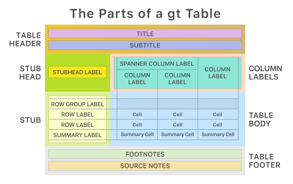

::: {.my-title}
# [Foundations of]{.my-subtitle} <br />[Data Science]{.blue}

::: {.my-grey}
[ |
]{}<br />
[Jeffrey M. Girard | Lecture ]{}
:::

{.absolute bottom=30 right=0 width="400"}
:::

```{r}
#| include: false
#| label: setup

library(here)
source(here("_common.R"))

library(tidyverse)
library(gt)

set_theme(theme_gray(base_size = 30))
```

## Roadmap

::: {.columns .pv4}

::: {.column width="60%"}
- Understand the structural anatomy of a `gt` table
- Build a table step-by-step (Headers, Stubs, and Spanners)
- Format and style data for clear communication
:::

::: {.column .tc .pv4 width="40%"}

:::

:::

# Table Anatomy

## The gt Package {.smaller}

::: {.columns .pv4}

::: {.column width="60%"}
- `gt` stands for the "Grammar of Tables"
  - It provides an intuitive pipeline for building display tables
  
::: {.fragment .mt1}
- Works perfectly with the tidyverse and pipes (`|>`)
:::

::: {.fragment .mt1}
- Helps transition from exploring data to communicating results
:::
:::

::: {.column .tc .pv4 width="40%"}

:::

:::

## Parts of a Table



## Building Blocks {.smaller}

::: {.columns .pv4}

::: {.column width="60%"}
- **Prep with dplyr:** Filter, select, and arrange data
  
::: {.fragment .mt1}
- **Initialize `gt()`:** Define stubs (rowname_col) and groups (groupname_col).
:::

::: {.fragment .mt1}
- **Build Structure:**
  - `tab_header()` for titles
  - `cols_label()` for clean names
  - `tab_spanner()` for column groups
  - `tab_footnote()` for definitions
  - `tab_source_note()` for data source

:::
:::

::: {.column .tc .pv4 width="40%"}

:::

:::

## Step 1: The Base Table

```{r}
#| output-location: slide

# Filter aggressively for a compact table
my_cars <- gtcars |> 
  filter(
    mfr == "Mercedes-Benz" | mfr == "Rolls-Royce"
  ) |> 
  select(mfr, model, hp, trq, year, bdy_style, msrp) |> 
  arrange(mfr, model)

# Create the base table
table1 <- 
  my_cars |> 
  gt(
    groupname_col = "mfr",
    rowname_col = "model"
  )
table1
```

## Step 2: The Header

```{r}
#| output-location: slide

# Adding a title and subtitle
table2 <- 
  table1 |> 
  tab_header(
    title = md("**Modern High-Performance Cars**"),
    subtitle = "Comparing Mercedes-Benz and Rolls-Royce"
  )
table2
```

## Step 3: Column Labels

```{r}
#| output-location: slide

# Renaming columns
table3 <- 
  table2 |> 
  cols_label(
    hp = "Horsepower",
    trq = "Torque",
    year = "Year",
    bdy_style = "Style",
    msrp = "MSRP"
  )
table3
```

## Step 4: Spanners

```{r}
#| output-location: slide

# Grouping columns with spanners
table4 <- 
  table3 |> 
  tab_spanner(
    label = "Performance",
    columns = c(hp, trq)
  ) |> 
  tab_spanner(
    label = "Configuration",
    columns = c(year, bdy_style)
  )
table4
```

## Step 5: The Footer

```{r}
#| output-location: slide

# Adding context to the bottom of the table
table5 <- 
  table4 |> 
  tab_source_note(
    source_note = md("Data from the *gtcars* dataset (v0.2.0.5).")
  ) |> 
  tab_footnote(
    footnote = "Manufacturer's suggested retail price.",
    locations = cells_column_labels(
      columns = msrp
    )
  )
table5
```

# Table Styling

## Formatting and Styling {.smaller}

::: {.columns .pv4}

::: {.column width="60%"}
- Formatting only alters appearance
- Does not alter underlying values
  
::: {.fragment .mt1}
- **Data Values:** `fmt_number()` (decimals) and `fmt_currency()` (money)
:::

::: {.fragment .mt1}
- **Alignment:** `cols_align()` adjusts text justification
:::

::: {.fragment .mt1}
- **Aesthetics:** `tab_style()` applies visuals
  - Location helpers (e.g., `cells_row_groups()`) target specific cells
  
:::
:::

::: {.column .tc .pv4 width="40%"}

:::

:::

## Step 6: Column Alignment

```{r}
#| output-location: slide

# Aligning the data columns to the center
table6 <- 
  table5 |> 
  cols_align(
    align = "center",
    columns = c(hp, trq, year, bdy_style)
  )
table6
```

## Step 7: Formatting Data

```{r}
#| output-location: slide

# Formatting the MSRP column as currency
table7 <- 
  table6 |> 
  fmt_currency(
    columns = msrp,
    decimals = 0
  )
table7
```

## Step 8: Styling Elements

```{r}
#| output-location: slide

# Making the manufacturer group labels bold and colored
table8 <- 
  table7 |> 
  tab_style(
    style = list(
      cell_text(weight = "bold"),
      cell_fill(color = "lightgray")
    ),
    locations = cells_row_groups()
  )
table8
```

## Putting It All Together

```{r}
#| output-location: slide

gtcars |> 
  filter(
    mfr == "Mercedes-Benz" | mfr == "Rolls-Royce"
  ) |> 
  select(mfr, model, hp, trq, year, bdy_style, msrp) |> 
  arrange(mfr, model) |> 
  gt(
    groupname_col = "mfr",
    rowname_col = "model"
  ) |> 
  tab_header(
    title = md("**Modern High-Performance Cars**"),
    subtitle = "Comparing Mercedes-Benz and Rolls-Royce"
  ) |> 
  cols_label(
    hp = "Horsepower",
    trq = "Torque",
    year = "Year",
    bdy_style = "Style",
    msrp = "MSRP"
  ) |> 
  tab_spanner(
    label = "Performance",
    columns = c(hp, trq)
  ) |> 
  tab_spanner(
    label = "Configuration",
    columns = c(year, bdy_style)
  ) |> 
  tab_source_note(
    source_note = md("Data from the *gtcars* dataset (v0.2.0.5).")
  ) |> 
  tab_footnote(
    footnote = "Manufacturer's suggested retail price.",
    locations = cells_column_labels(
      columns = msrp
    )
  ) |> 
  cols_align(
    align = "center",
    columns = c(hp, trq, year, bdy_style)
  ) |> 
  fmt_currency(
    columns = msrp,
    decimals = 0
  ) |> 
  tab_style(
    style = list(
      cell_text(weight = "bold"),
      cell_fill(color = "lightgray")
    ),
    locations = cells_row_groups()
  )
```

