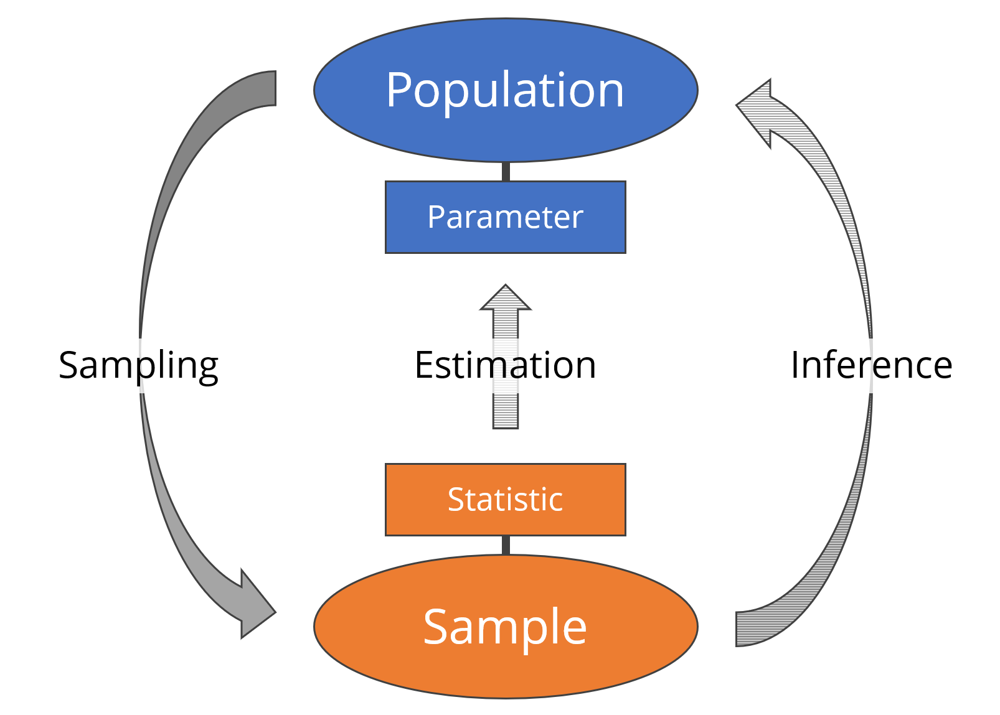

::: {.my-title}
# [Foundations of]{.my-subtitle} <br />[Data Science]{.blue}

::: {.my-grey}
[ | ]{}<br />
[Jeffrey M. Girard | Lecture ]{}
:::

{.absolute bottom=30 right=0 width="400"}
:::

```{r}
#| include: false
#| label: setup

library(here)
source(here("_common.R"))

library(tidyverse)
library(afex)
library(easystats)

set_theme(theme_gray(base_size = 30))
```

## Roadmap

::: {.columns .pv4}

::: {.column width="60%"}
- Understand the difference between samples and populations

- Learn the structure of independent and dependent groups

- Run group comparisons using `afex` and `easystats`
:::

::: {.column .tc .pv4 width="40%"}

:::

:::

# EDA vs. Inference

## The Trap of the Sample {.fs70}

::: {.columns .pv4}

::: {.column width="60%"}
- We have been turning data into tables and figures
    + This is called Exploratory Data Analysis (EDA)

::: {.fragment .mt1}
- This only tells us about *our specific data*
    + These tables and figures don't tell us whether the patterns we saw are universally true
  
:::

::: {.fragment .mt1}
- We often want to generalize *beyond our data*
    + If Group A has a higher mean than Group B in our data, is that also true more broadly?
  
:::
:::

::: {.column .tc .pv4 width="40%"}

:::

:::

## Populations vs. Samples {.fs70}

- The [Population]{.b .blue} is the entire group we want to understand
    + *e.g., All penguins in Antarctica*
    + We rarely have access to the whole population

::: {.fragment .mt1}
- The [Sample]{.b .green} is the subset of data we actually collected
    + *e.g., The 344 penguins in our dataset*
    + Samples are imperfect but may be all we have
    
:::

## Parameters vs. Statistics {.fs70}

- A [Parameter]{.b .blue} is the "true" number in the population
    + *e.g., the real average body mass of all penguins in Antarctica*
    + This number is fixed, but we usually do not know it

::: {.fragment .mt1}
- A [Statistic]{.b .green} is the number we calculate from our sample
    + *e.g., the average body mass of the penguins we happened to catch*
    + We use the statistic to estimate the parameter
    
:::

::: {.fragment .mt1}
- [Sampling Uncertainty]{.b .dark-red} is the idea that every sample is different
    + If we catch 10 different penguins, our statistic will change slightly
    + Statistical tests help us decide if patterns in our sample are "real"
  
:::

## Mapping the Connections

{width="800"}

## Why Compare Groups? {.fs70}

Comparing groups is a fundamental tool in Data Science. It allows us to move from simply describing data to evaluating impact and making decisions.

::: {.fragment .mt1}
- **Basic Science** (Discovery)
    + Are there natural differences between categories?
    + *e.g., Do Adelie penguins differ in body mass from Gentoo penguins?*
    
:::

::: {.fragment .mt1}
- **Applied Science** (Intervention)
    + Does a specific treatment or change have a real effect?
    + *e.g., Does a new medication lower blood pressure more than a placebo?*
    
:::

::: {.fragment .mt1}
- **Business & Tech** (Optimization)
    + Which strategy leads to better outcomes?
    + *e.g., A/B Testing: Does a red "Buy" button generate more revenue than a blue one?*
    
:::

## The Logic of Hypothesis Testing {.fs70}

Every statistical test we will learn uses the same underlying logic

::: {.fragment .mt1}
- **The Null Hypothesis ($H_0$):** The "baseline" assumption
    + It assumes nothing interesting is happening in the population
    + For group comparisons, $H_0$ assumes all group means are exactly equal
    
:::

::: {.fragment .mt1}
- **The Alternative Hypothesis ($H_1$):** The "discovery" assumption
    + It is the claim about the hypothesis we are looking for evidence to support
    + For group comparisons, $H_1$ assumes at least one group mean is different
    
:::

::: {.fragment .mt1}
- **The *p*-value:**
    + How consistent are our sample data with the Null Hypothesis?
    + If *p* < .05, we (traditionally) begin to doubt $H_0$ and believe $H_1$ instead
    
:::

# Group Designs

## How is the Data Structured? {.fs70}

Before running any tests, R needs to know how the groups are related.

::: {.fragment .mt1}
- [Independent Groups]{.b .blue} (Between-Subjects)
    + Comparing completely different entities
    + *e.g., (Male vs. Female) or (Adelie vs. Chinstrap vs. Gentoo) penguins*
  
:::

::: {.fragment .mt1}
- [Dependent Groups]{.b .green} (Within-Subjects / Repeated Measures)
    + Comparing the exact same entities across different conditions
    + *e.g., The Same Penguin Chicks on (Day 0 vs. Day 10 vs. Day 20)*

:::

## Setup: Packages

```{r}
#| message: false

library(tidyverse) # data prep and visualization
library(afex) # fitting ANOVA statistical models
library(easystats) # extracting info from models
library(marginaleffects) # needed by easystats
```

# The Statistical Engine

## The Logic of ANOVA {.fs70}

- We will use a statistical model called **ANOVA** (Analysis of Variance)
    + It works for comparing two groups or comparing multiple groups

::: {.fragment .mt1}
- Conceptually, ANOVA compares **signal** to **noise**:
    + **Signal:** How different are the group averages from one another?
    + **Noise:** How much random variation is there *within* the groups?
    
:::

::: {.fragment .mt1}
- If the signal is significantly louder than the noise...
    + ...we can safely conclude the groups are truly different in the population
    
:::

## Understanding the *p*-value {.fs70}

- When we run our ANOVA, it outputs a **p-value** (probability value)
    + It measures how "surprised" we should be by our sample data if there were actually *no real differences* in the population

::: {.fragment .mt1}
- **Large p-value (e.g., p = .40):** Our data is not surprising. The differences we see could easily just be random sampling noise
:::

::: {.fragment .mt1}
- **Small p-value (e.g., p < .05):** Our data is very surprising. It is highly unlikely we would see these differences just by random chance
    + We call this **statistically significant** and conclude the population parameters differ
    
:::

::: {.fragment .mt1}
- [The Catch:]{.b .dark-red} Statistics deals in probabilities, not absolute proofs
    + Even with a significant result, there is always a small chance of a "false positive"
    
:::

# Two Independent Groups

## 1. Preparing the Data {.fs70}

We will use the `penguins` dataset to compare body mass between Males and Females.

::: {.fragment .mt1}
```{r}
#| message: false 

data("penguins", package = "datasets")

dat1 <- 
  penguins |> 
  drop_na(body_mass, sex) |> # Remove penguins with missing data
  mutate(
    id = row_number(), # afex requires an explicit ID column
    sex = factor(sex) # treat sex as a categorical variable
  ) |> 
  select(id, sex, body_mass) # select only used variables

glimpse(dat1)
```
:::

## 2. Exploring our Sample

```{r}
ggplot(dat1, aes(x = sex, y = body_mass, fill = sex)) + geom_boxplot()
```

## 3. The Omnibus Test {.fs70}

The `aov_ez()` function tells us if there are any differences between our groups. Since there are only two groups here, this is mathematically identical to an independent t-test.

::: {.fragment .mt1}
```{r}
fit1 <- aov_ez(
  id = "id",
  dv = "body_mass",
  between = "sex",
  data = dat1
)
model_parameters(fit1)
```

**Interpretation:** The significant result (*p* < .001) means the effect of sex is statistically significant. This provides strong evidence to suggest that, in the broader *population*, the true average body mass differs between male and female penguins.
:::

## 4. Mean Estimates {.fs70}

We use `estimate_means()` to guess what the group means are in the population

We can also plot those model-based estimates (and, optionally, the sample data)

::: {.fragment .mt1}
::: {.columns}
::: {.column}
```{r}
means1 <- estimate_means(fit1) |> print()
```
:::
::: {.column}
```{r}
plot(means1, show_data = TRUE)
```
:::
:::
:::

# Three Independent Groups

## 1. Preparing the Data {.fs70}

What if we have more than two groups? We use the exact same functions. Let's start by looking at our `penguins` data again. We will use the `species` variable to illustrate this, as there are 3 species represented in this sample.

::: {.fragment .mt1}
```{r}
data("penguins", package = "datasets")

dat2 <- 
  penguins |>
  drop_na(body_mass, species) |> 
  mutate(
    id = row_number(),
    species = factor(species)
  ) |> 
  select(id, species, body_mass)

glimpse(dat2)
```
:::

## 2. Exploring our Sample

```{r}
ggplot(dat2, aes(x = species, y = body_mass, fill = species)) + geom_boxplot()
```

## 3. The Omnibus Test {.fs70}

Now we swap `between = "sex"` to `between = "species"`.

::: {.fragment .mt1}
```{r}
fit2 <- aov_ez(
  id = "id",
  dv = "body_mass",
  between = "species",
  data = dat2
)
model_parameters(fit2)
```

**Interpretation:** The significant result (*p* < .001) suggests that the true average body mass in the *population* is not identical across all three species. This gives us evidence that species is related to mass, though we cannot yet say which specific ones differ.
:::

## 4. Estimating Means {.fs70}

::: {.columns}
::: {.column}
```{r}
means2 <- estimate_means(fit2) |> print()
```
:::
::: {.column}
```{r}
plot(means2, show_data = TRUE)
```
:::
:::

## 5. Contrasting Groups {.fs70}

The `estimate_contrasts()` function automatically tests all pairs and adjusts the *p*-values to protect us from false positives (due to multiple tests).

::: {.fragment .mt1}
```{r}
estimate_contrasts(fit2, p_adjust = "holm")
```

**Interpretation:** We found significant differences (*p* < .001) when comparing Gentoos to both Adelies and Chinstraps, suggesting these mass differences likely exist in the population. However, the difference between Chinstraps and Adelies was not significant (*p* > .05), meaning we lack evidence to say their true population means differ.
:::

# Three Dependent Groups

## 1. Preparing the Data {.fs70}

When testing the same subjects multiple times, the data must be in a long format. We will use the `ChickWeight` dataset to see if chicks gained weight between Days 0, 10, and 20.

::: {.fragment .mt1}
```{r}
data("ChickWeight", package = "datasets")

dat3 <- 
  ChickWeight |>
  drop_na(weight, Time) |> 
  filter(Time %in% c(0, 10, 20)) |>
  mutate(Time = factor(Time, labels = c("day0", "day10", "day20"))) |> 
  select(Chick, Time, weight)

glimpse(dat3)
```
:::

## 2. Exploring our Sample

```{r}
ggplot(dat3, aes(x = Time, y = weight, group = Chick)) + 
  geom_point() + 
  geom_line(alpha = 0.5)
```

## 3. The Omnibus Test {.fs70}

To tell R to run a dependent test, swap the `between` argument for `within`

```{r}
#| R.options:
#|   width: 120
#| warning: false

fit3 <- aov_ez(
  id = "Chick", 
  dv = "weight",
  within = "Time", 
  data = dat3
)
model_parameters(fit3)
```

**Interpretation:** The significant *p*-value (*p* < .001) indicates that the true average weight of the *population* likely does not stay constant across these three time points. This points to a broader growth trend beyond just our specific sample.


## 4. Estimating Means {.fs70}

::: {.columns}
::: {.column}
```{r}
means3 <- estimate_means(fit3) |> print()
```
:::
::: {.column}
```{r}
plot(means3, show_data = TRUE)
```
:::
:::

## 5. Contrasting Groups {.fs70}

```{r}
estimate_contrasts(fit3, p_adjust = "holm")
```

**Interpretation:** All three pairwise comparisons are statistically significant. This provides evidence to suggest that the true average weight in the *population* increases at each of these measured intervals (from Day 0 to 10, and Day 10 to 20).
