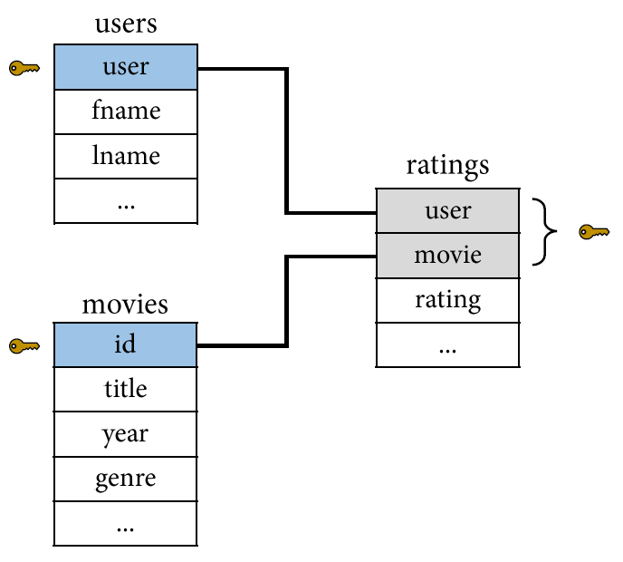
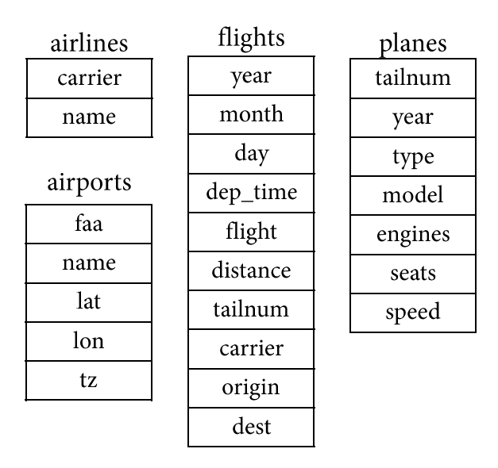
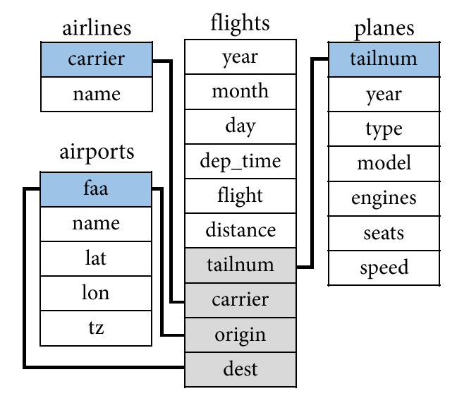
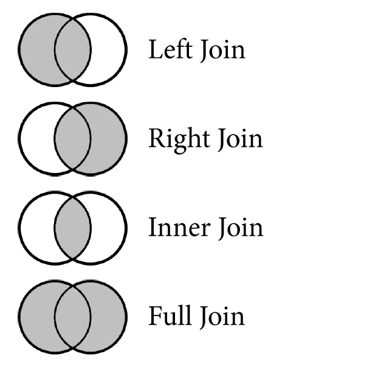

::: {.my-title}
# [Foundations of]{.my-subtitle} <br />[Data Science]{.blue}

::: {.my-grey}
[ | ]{}<br />
[Jeffrey M. Girard | Lecture ]{}
:::

{.absolute bottom=30 right=0 width="400"}
:::

```{r}
#| include: false
#| label: setup

library(here)
source(here("_common.R"))

library(tidyverse)
library(nycflights13)
library(knitr)
library(kableExtra)

options(
  tibble.print_max = 5,
  tibble.print_min = 5
)

set_theme(theme_gray(base_size = 24))
```

## Roadmap

::: {.columns .pv4}

::: {.column width="60%"}
- Understand the principles of relational data and keys

- Conceptually differentiate mutating join types

- Perform joins in R using {dplyr} functions
:::

::: {.column .tc .pv4 width="40%"}

:::

:::

# Relational Data

## Relational Data {.smaller}

- A set of inter-related tables is called a *relational database* (RDB)

::: {.columns .pv4}

::: {.column .tc width="50%"}

[ratings]{.b .blue}

```{r}
#| echo: false
#| message: false

ratings <- 
  tribble(
    ~user, ~movie, ~rating,
    "sing.it.sam", 1, "★☆☆☆☆",
    "sing.it.sam", 2, "★★★★★",
    "macattack", 1, "★★★★☆",
    "macattack", 2, "★★☆☆☆",
    "inzain99", 1, "★★★☆☆",
    "inzain99", 2, "★★☆☆☆"
  )
kable(ratings) |> 
  kable_styling(bootstrap_options = "striped")
```

:::

::: {.column .tc width="50%"}
[users]{.b .blue}

```{r}
#| echo: false
#| message: false

users <- 
  tribble(
    ~user, ~fname, ~lname,
    "sing.it.sam", "Sam", "Jones",
    "macattack", "Alex", "Mackey",
    "inzain99", "Zain", "Baker"
  )
kable(users) |> 
  kable_styling(bootstrap_options = "striped")
```

[movies]{.b .blue}

```{r}
#| echo: false
#| message: false

movies <- 
  tribble(
    ~id, ~title, ~year, ~genre,
    1, "John Wick 2", 2017, "Action",
    2, "Frozen II", 2019, "Family"
  )
kable(movies) |> 
  kable_styling(bootstrap_options = "striped")
```

:::

:::

## Relational Data {.smaller}

- To **join** the tables into one unified dataset, we need to know their connections

```{r}
#| echo: false
#| warning: false

right_join(users, ratings, by = c("user" = "user")) |> 
  left_join(movies, by = c("movie" = "id")) |> 
  relocate(rating, .after = genre) |> 
  kable() |> 
  kable_styling(bootstrap_options = "striped")
```

## Keys {.smaller}

::: {.columns .pv4}

::: {.column .tc width="50%"}
- Data is [relational]{.b .blue} when one observation references another observation
- Each observation needs to be uniquely identified by one or more variables
  - These variables are called "keys"
- [Natural keys]{.b .green} are meaningful
  - e.g., `users$user`
- [Surrogate keys]{.b .green} are meaningless
  - e.g., `movies$id`
- The ratings table has a double-key
:::

::: {.column .tc width="50%"}



:::

:::

## Complex Databases {.smaller}

- Let's try to guess the connections for the {nycflights13} package's tables

::: {.columns .pv4}

::: {.column .tc width="50%"}


:::

::: {.column .tc .fragment width="50%"}



:::

:::


# Basic Join Types

## Basic Join Types {.smaller}

- The basic joins handle non-overlapping or missing observations differently

::: {.columns .pv4}

::: {.column .tc width="25%"}

[movies]{.b .blue}

```{r}
#| echo: false

movies_mini <- tribble(
  ~movie, ~year,
  1, 2020,
  2, 2003,
  3, 2019,
  4, 2006,
  5, 2003,
  6, 2002
)
kable(movies_mini)
```

:::

::: {.column .tc width="25%"}

[avg_ratings]{.b .blue}

```{r}
#| echo: false

avg_ratings_mini <- tribble(
  ~movie, ~average,
  2, 2.2,
  3, 8.0,
  4, 6.7,
  5, 8.7,
  6, 3.5,
  7, 7.5
)
kable(avg_ratings_mini)
```

:::

::: {.column width="15%"}

:::

::: {.column width="35%"}



:::

:::

## Left Join {.smaller}

::: {}
- Left join includes all rows in the [left] table; those missing in the [right] table get NA
:::

::: {.columns .pv4}

::: {.column .tc width="25%"}

[movies]{.b .blue}

```{r}
#| echo: false
kable(movies_mini)
```

:::

::: {.column .tc width="25%"}

[avg_ratings]{.b .blue}

```{r}
#| echo: false
kable(avg_ratings_mini)
```

:::

::: {.column .tc width="50%"}

[Left Join (movies, avg_ratings)]{.b .green}

```{r}
#| echo: false

df <- left_join(movies_mini, avg_ratings_mini, by = "movie")
kable(df, "html") |> 
  column_spec(3, color = ifelse(is.na(df$average), "red", "black"))
```

:::

:::

## Right Join {.smaller}

::: {}
- Right join includes all rows in the [right] table; those missing in the [left] table get NA
:::

::: {.columns .pv4}

::: {.column .tc width="25%"}

[movies]{.b .blue}

```{r}
#| echo: false
kable(movies_mini)
```

:::

::: {.column .tc width="25%"}

[avg_ratings]{.b .blue}

```{r}
#| echo: false
kable(avg_ratings_mini)
```

:::

::: {.column .tc width="50%"}

[Right Join (movies, avg_ratings)]{.b .green}

```{r}
#| echo: false

df <- right_join(movies_mini, avg_ratings_mini, by = "movie")
kable(df, "html") |> 
  column_spec(2, color = ifelse(is.na(df$year), "red", "black"))
```

:::

:::

## Inner Join {.smaller}

::: {}
- Inner join includes only rows present in both the [left] and [right] tables; no new NAs
:::

::: {.columns .pv4}

::: {.column .tc width="25%"}

[movies]{.b .blue}

```{r}
#| echo: false
kable(movies_mini)
```

:::

::: {.column .tc width="25%"}

[avg_ratings]{.b .blue}

```{r}
#| echo: false
kable(avg_ratings_mini)
```

:::

::: {.column .tc width="50%"}

[Inner Join (movies, avg_ratings)]{.b .green}

```{r}
#| echo: false

df <- inner_join(movies_mini, avg_ratings_mini, by = "movie")
kable(df, "html")
```

:::

:::

## Full Join {.smaller}

::: {}
- Full join includes all rows in either the [left] or [right] table; missing values become NAs
:::

::: {.columns .pv4}

::: {.column .tc width="25%"}

[movies]{.b .blue}

```{r}
#| echo: false
kable(movies_mini)
```

:::

::: {.column .tc width="25%"}

[avg_ratings]{.b .blue}

```{r}
#| echo: false
kable(avg_ratings_mini)
```

:::

::: {.column .tc width="50%"}

[Full Join (movies, avg_ratings)]{.b .green}

```{r}
#| echo: false

df <- full_join(movies_mini, avg_ratings_mini, by = "movie")
kable(df, "html") |> 
  column_spec(2, color = ifelse(is.na(df$year), "red", "black")) |> 
  column_spec(3, color = ifelse(is.na(df$average), "red", "black"))
```

:::

:::

# Tidyverse Joins

## Tidyverse Joins {.smaller}

::: {.columns .pv4}

::: {.column width="60%"}
- {dplyr} has intuitive, standard names for these concepts
    + `left_join(x, y, by)`
    + `right_join(x, y, by)`
    + `inner_join(x, y, by)`
    + `full_join(x, y, by)`
    
- It is easiest if the key variables have the same names in both tibbles
    + e.g., `by = "carrier"`
    + e.g., `by = c("user", "movie")`
    
- But you can join by differently named keys too
    + e.g., `by = join_by(faa == origin)`
    
:::

::: {.column .tc .pv4 width="40%"}

:::

:::

## Preparing our Data

::: {.fsmaller}
Let's examine a subset of columns from `flights`.
:::

```{r}
data("flights", package = "nycflights13")

flights2 <- 
  flights |> 
  select(month, day, flight, origin, dest, tailnum, carrier) |> 
  print()
```


## The Airlines Dataset

::: {.fsmaller}
Before we join, let's look at the `airlines` dataset.
:::

```{r}
data("airlines", package = "nycflights13")

airlines
```


## Left Join in R

::: {.fsmaller}
**Question:** *What is the full name of the airline carrier for each flight?*

A left join is perfect for looking up and adding reference information to our primary dataset. Notice that the number of rows remains exactly the same.
:::

```{r}
flights2 |> 
  left_join(airlines, by = "carrier")
```


## The Airports Dataset

::: {.fsmaller}
Next, let's select a few columns from `airports`.
:::

```{r}
data("airports", package = "nycflights13")

airports2 <- 
  airports |> 
  select(faa, name) |> 
  print()
```


## Joining by Different Names

::: {.fsmaller}
If the key variables are named differently across datasets, we provide `by` with the `join_by()` function. The order should match `first == second`.
:::

```{r}
flights2 |> 
  left_join(airports2, by = join_by(origin == faa))
```


## Duplicate Column Names

::: {.fsmaller}
We now have the name.x (origin) and name.y (dest)...
:::

```{r}
flights2 |> 
  left_join(airports2, by = join_by(origin == faa)) |> 
  left_join(airports2, by = join_by(dest == faa))
```

## Changing the Suffixes

::: {.fsmaller}
We can replace ".x" and ".y" using `suffix` in the second join.
:::

```{r}
flights2 |> 
  left_join(airports2, by = join_by(origin == faa)) |> 
  left_join(airports2, by = join_by(dest == faa),
            suffix = c("_origin", "_dest"))
```

## The Planes Dataset

::: {.fsmaller}
Finally, let's select a few columns from `planes`.
:::

```{r}
data("planes", package = "nycflights13")

planes2 <- 
  planes |> 
  select(tailnum, manufacturer, model) |> 
  print()
```

## Missing Matches

::: {.fsmaller}
If `flights2` has a key that does not exist in the right dataset, the joined variables become `NA`. Let's look at plane "N3ALAA" to see this in action.
:::

```{r}
flights2 |> 
  left_join(planes2, by = "tailnum") |> 
  filter(tailnum == "N3ALAA")
```

## Inner Join in R

::: {.fsmaller}
**Question:** *Which flights were flown by planes that we have registry data for?*

To only return rows that have a match in both tables, use inner join. Our row count will decrease because it drops flights with missing plane data.
:::

```{r}
flights2 |> 
  inner_join(planes2, by = "tailnum")
```

## Right Join in R

::: {.fsmaller}
**Question:** *Which airports in our data received zero flights from NYC in 2013?*

A right join is useful when we want to keep all observations from a reference table on the right without breaking the flow of our code. 
:::

```{r}
flights2 |> 
  right_join(airports2, by = join_by(dest == faa)) |> 
  filter(is.na(flight)) |> 
  select(dest, name)
```

## Full Join in R

::: {.fsmaller}
**Question:** *Overall, how many flights went to unlisted airports, and how many listed airports received zero flights?*

A full join keeps *all* rows from both tables. By joining flights with airports, we can audit the overlaps and missing matches across our entire database.
:::

```{r}
flights2 |> 
  full_join(airports2, by = join_by(dest == faa)) |> 
  count(
    missing_airport = is.na(name),
    missing_flight = is.na(flight)
  )
```
